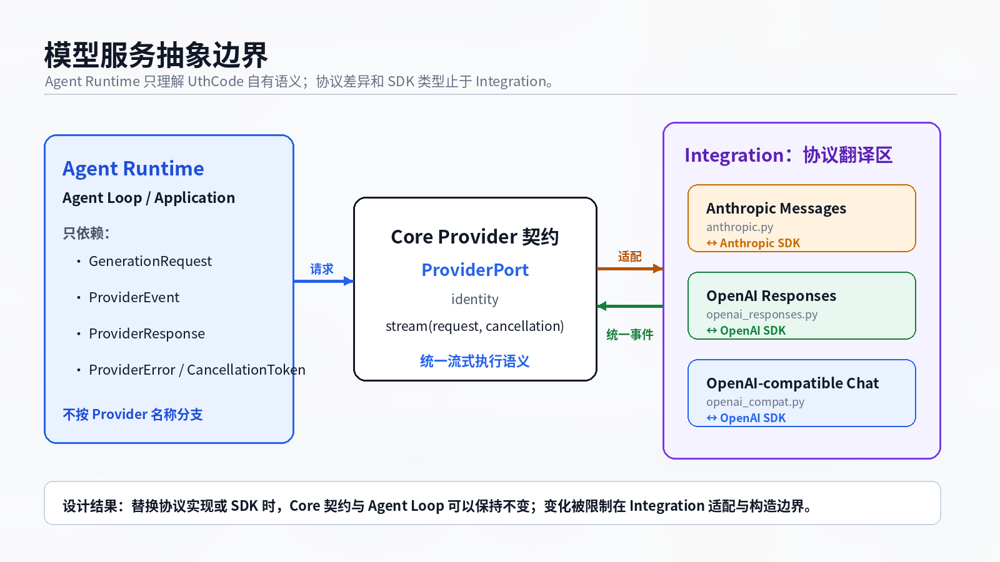
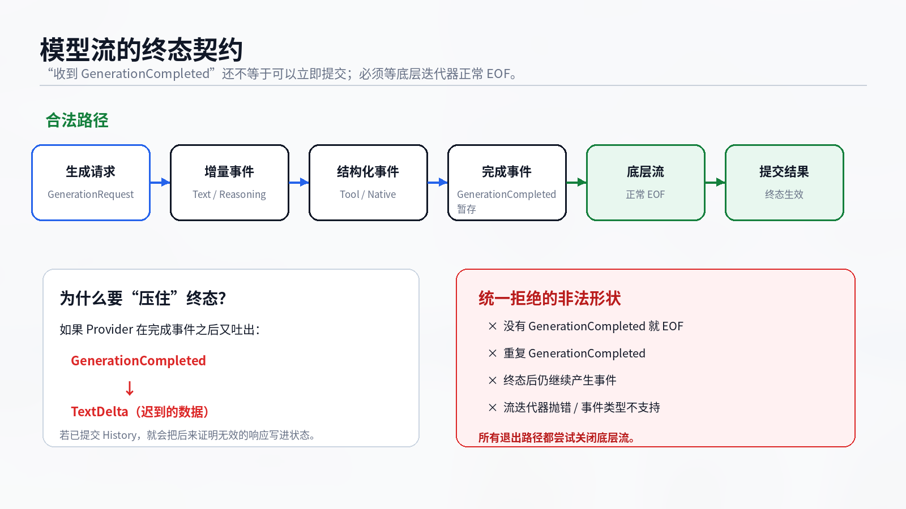

# 模型服务抽象：让 Agent Runtime 不认识厂商 SDK

假设同一个 Coding Agent 今天使用 Anthropic Messages，明天切到 OpenAI Responses，另一个部署又通过 OpenAI-compatible Chat Completions 接入第三方模型。

如果 Agent Loop 直接理解三套 SDK，它很快会变成这样：

```text
准备一次模型请求
    ↓
按厂商分别拼请求
    ↓
按厂商分别处理流事件、错误、终态和 Tool Call
```

这会把“Agent 如何运行”和“某家模型服务如何说话”粘在一起。每增加一个 Provider，Runtime 都要重新理解一批协议细节；SDK 升级也可能迫使 Core 跟着变化。

UthCode 采用相反的边界：**Core 先定义自己真正需要的 Provider 语义，Integration 再把这套语义翻译成具体厂商协议。**



## Core 拥有运行语义，Integration 拥有协议差异

当前 Core 中的 Provider 契约由 UthCode 自己定义。`GenerationRequest` 表达一次生成所需的通用输入；`ProviderPort` 提供统一的流式入口；上层消费的是 `ProviderEvent`，而不是 Anthropic 或 OpenAI SDK 的原生事件对象。

统一事件包括文本增量、推理增量、工具调用的开始与参数增量、工具调用完成、原生协议快照完成以及最终 `GenerationCompleted`。错误和取消同样被归一化成 Core 能理解的语义。

所以 Agent Loop 不需要知道：Anthropic 把工具调用放在 `tool_use` content block 中，OpenAI Responses 使用 `function_call` item，Chat Completions 又通过按索引聚合的 `tool_calls` chunk 产生调用。协议差异只留在 `integrations/providers/` 对应模块里。

请求出去时，Integration 把 `GenerationRequest` 转成目标协议的 system / instructions、message / item、tool schema 和 reasoning 参数；流回来时，再把原生事件聚合、校验并转换成统一事件、Usage、FinishReason 和 ProviderResponse。

这里有一条很重要的约束：**厂商 SDK 类型不能越过 Integration 边界。** 一旦 SDK 对象进入 Core，Provider 抽象就会从内部被击穿。

## 共享代码为什么要保持很薄

三套协议确实存在一些共同操作，例如 JSON-safe 转换、Usage 整数校验、流关闭和取消检查。UthCode 把这些放在共用辅助模块中，但没有再建立一套“万能 Provider 基类”。

原因很简单：协议状态、事件聚合、重复帧处理和终态判断并不真的相同。过度抽象会把差异藏进越来越复杂的条件分支，最后只是把三套协议重新揉进一个文件。

因此共用层只共享真正稳定的辅助能力，协议语义仍由各自 Integration 拥有。

## 一条 Provider 流什么时候才算真的完成

统一事件并不意味着 Runtime 可以盲目信任任何事件序列。最危险的情况是：底层先发出 `GenerationCompleted`，Runtime 立即提交结果，随后迭代器又出现一个事件或在 EOF 前抛错。

UthCode 用 `validated_provider_stream` 把这个边界收紧：完成事件先被暂存，只有底层迭代器正常结束、并且没有尾随事件之后，终态才真正交给上层。



合法流满足：

```text
零到多个普通事件
        ↓
恰好一个 GenerationCompleted
        ↓
底层流正常 EOF
        ↓
终态生效
```

缺少终态、重复终态、终态之后仍有事件或出现不支持的事件类型，都属于 Provider 边界错误；退出路径还必须关闭底层流。

这意味着 Agent Loop 得到的不是“SDK 刚刚发来的一个看起来像完成的对象”，而是**已经通过 Core 终态协议验证的一次生成结果**。

## 为什么这条边界能经受实现替换

T01 最初的真实 Provider 曾经过 Pydantic AI Direct Model API；后续 T01-2 又把这层中间实现破坏式替换为 Anthropic / OpenAI 官方异步 SDK。变化很大，但已经验收的 Core Provider 契约和 Application 行为被保留下来。

这正好说明模型服务抽象隔离的不是几个类名，而是两类变化速度不同的东西：

```text
相对稳定：Agent Runtime 需要的 Request / Event / Error / Cancellation 语义
                         │
                         │ 稳定边界
                         ▼
经常变化：Provider 协议、SDK、流事件形状与字段
```

统一契约也不能粗暴抹掉所有厂商信息。Reasoning 签名、Responses item identity 等数据如果只剩通用语义，下一轮可能无法高保真恢复原协议。这个问题由下一篇 [原生协议快照](./02-原生协议快照.md) 处理。

理解这套机制时，可以记住四条线：

```text
Runtime 不按 Provider 名称分支
SDK 类型不越过 Integration
通用 Provider 语义由 Core 拥有
协议特有状态由对应 Integration 拥有
```

模型服务抽象的目标不是让所有服务“看起来完全一样”，而是让 Runtime 只依赖自己真正需要的稳定语义，把协议变化限制在正确的边界内。
