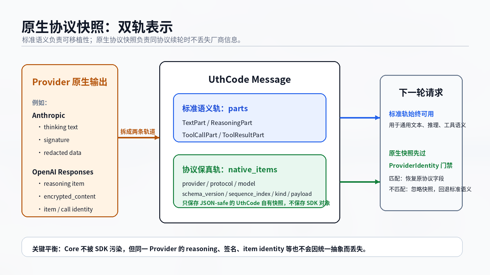
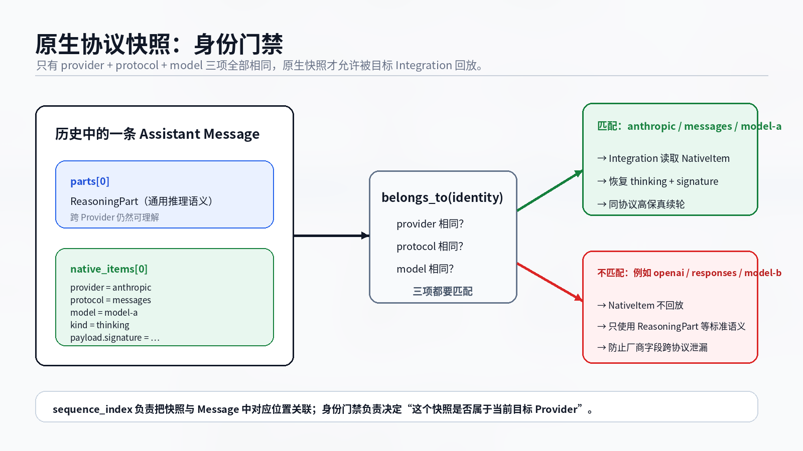

# 原生协议快照：统一语义之外如何保持协议保真

Provider 抽象会遇到一个矛盾：**归一化太少，Core 会被厂商协议污染；归一化太狠，又会把下一轮真正需要的原生信息丢掉。**

以 Anthropic 的 reasoning 为例。对 Agent Runtime 来说，它首先是一段推理内容，用 `ReasoningPart` 表达就足够了。但原生 thinking block 还可能携带 signature 或 redacted data；继续使用同一协议时，这些字段不能靠普通文本重新创造出来。

OpenAI Responses 也有类似问题：reasoning、message、function call 等 item 除了通用语义，还带有 item identity、顺序、encrypted content、call identity 等协议数据。

直接把 SDK 对象塞进 Message 可以保真，却会破坏 Provider 边界；只保存统一 Part 又可能无法高保真续轮。UthCode 因此让一条 Message 同时拥有**标准语义轨**和**原生协议快照轨**。



## 标准 Part 保存“这是什么意思”

`Message.parts` 保存 Runtime 能长期理解的公共语义：`TextPart`、`ReasoningPart`、`ToolCallPart` 和 `ToolResultPart`。

它们不属于任何厂商。Agent Loop、History、Context，以及其他 Provider 都能理解这些 Part。比如某个 Provider 返回一段 reasoning，进入 Core 后至少会留下 `ReasoningPart`；即使下一轮切换 Provider，系统仍然知道“这里是一段推理内容”。

这条轨道解决的是**可移植性**。

## NativeItem 保存“原协议到底长什么样”

代码中的 `NativeItem` 保存无法安全压进通用 Part、但同协议续轮仍可能需要的原生协议快照。

它不是 SDK 对象缓存，而是 UthCode 自有、不可变、JSON-safe 的数据模型。核心字段包括：

```text
provider
protocol
model
schema_version
sequence_index
kind
payload
```

`payload` 只保存安全可序列化的数据，不保存 SDK Client、流对象或其他运行时对象。`sequence_index` 则负责把快照与 Message 中对应位置重新对齐。

这条轨道解决的是**同协议保真**。

因此两条轨道的职责很清楚：

```text
parts
= Agent Runtime 能长期理解的公共语义

native_items
= 某个 Provider 身份专属的协议快照
```

## 原生快照为什么不能无条件回放

如果历史里保存了一个 Anthropic thinking block 的 signature，显然不能在切到 OpenAI Responses 后仍把这份 Anthropic payload 塞进新请求。

UthCode 因此给原生快照增加了严格的 `ProviderIdentity` 门禁。身份由三项组成：

```text
provider + protocol + model
```

只有三项全部匹配，目标 Integration 才允许读取并回放对应 NativeItem。



下一轮仍然调用 `anthropic / messages / model-a` 时，Integration 可以把标准 `ReasoningPart` 与匹配的 NativeItem 对齐，恢复带签名的原生 thinking block。

如果目标变成 `openai / responses / model-b`，这份快照不属于目标身份，因此不会被回放。新的 Integration 只使用可移植的标准语义，再按照自己的协议重新编码。

所以切换 Provider 时，UthCode 做的不是“把所有原生历史翻译到另一家协议”，而是：

```text
同身份
→ 尽可能恢复原生协议字段

不同身份
→ 忽略不属于目标 Provider 的快照
→ 保留并使用 Core 标准语义
```

## 为什么不把厂商字段全部扩进 Core Message

表面上也可以不断给 `ReasoningPart`、`ToolCallPart` 增加厂商字段：今天加 `signature`，明天加 `encrypted_content`，后天再加某家协议的 item id。

最终 Core 会变成所有 Provider 字段的合集。所谓“统一模型”只是把三套协议从 Integration 搬进了 Core，Provider 抽象也就失去了意义。

NativeItem 把这个变化方向反过来：**Core 只规定快照必须是安全、可序列化、带身份和顺序的 UthCode 数据；具体 payload 的结构仍由拥有该协议的 Integration 负责。**

因此增加新的协议保真字段时，不需要让 Agent Runtime 学会那个 Provider 的所有细节。

## NativeItem 不是第二套消息系统

原生协议快照很容易被误解成“旁路的一份完整 Provider History”，但它并不拥有公共语义。

`Message.parts` 仍然是主干；NativeItem 只补充无法丢失的协议细节，而且必须经过 ProviderIdentity 门禁。它不能绕开统一的 Message、Tool Call、Usage、终态和错误语义，也不能让 SDK 对象直接进入 Core。

可以把这套设计记成一句话：

> **标准 Part 保存意义，NativeItem 保存同协议续轮需要的原始细节。**

这样 UthCode 同时避开了两个极端：既不会为了多 Provider 把 Core 变成厂商字段合集，也不会为了追求“抽象得漂亮”而牺牲真实协议的可恢复性。

如果还没有理解外层 Provider 边界，可以先阅读 [模型服务抽象](./01-模型服务抽象.md)。
