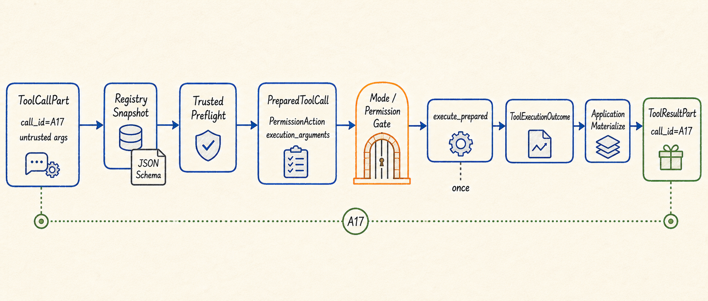
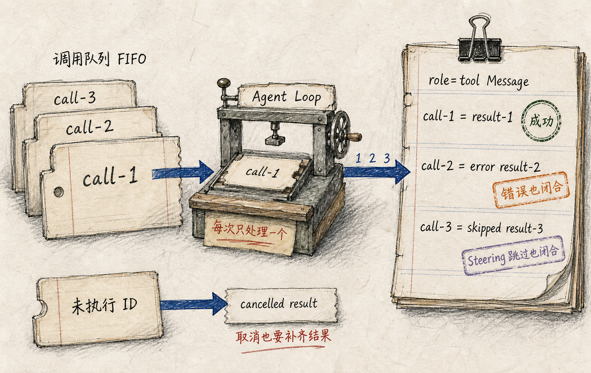

# 工具调用闭合协议：从不可信 ToolCall 到同 ID ToolResult

假设模型在一次响应里同时提出三个动作：读取配置文件、修改其中一项，再运行测试。对模型来说，这只是三个结构化 `ToolCall`；对 Agent Runtime 来说，它们却是三个尚未验证、可能失败、可能暂停、也可能产生副作用的外部请求。

最直接的实现是按名字找到函数，然后依次调用。但这种实现很快会遇到几个难题：参数不符合 schema 时要不要继续？权限审批回来后是否重新解析路径？某个工具抛出异常后，后面的调用还执行吗？用户取消时，尚未启动的调用怎样从对话协议中消失？工具已经产生副作用、但结果保存失败时，能不能自动重试？

UthCode 把这些问题收敛为一条**工具调用闭合协议**：模型产生的调用先成为受验证、受控制的执行对象；无论成功、拒绝、错误、取消还是跳过，每个原始 `tool_call_id` 最终都必须得到一个对应的 `ToolResultPart`。只有这组结果闭合后，模型才能进入下一次推理。

## Call ID 是一次动作的闭合键

Provider 可以用不同原生格式表达工具调用，但进入 Core 后都转换为同一组数据：

```text
ToolDefinition  描述工具名称和参数 JSON Schema
ToolCallPart    保存 tool_call_id、工具名和参数
ToolResultPart  保存同一个 tool_call_id、结果正文和错误标记
```

`tool_call_id` 不是展示编号，而是调用与结果之间的协议关联键。下一次请求中，Provider 需要看到原始 Assistant ToolCall 和与之配对的 Tool Result；如果一个 ID 没有结果，或者一个 ID 被闭合两次，对话就不再是一条完整的工具往返。

因此 UthCode 不把“工具发生错误”理解成“这条调用可以从历史中删掉”。未知工具、参数错误、权限拒绝、执行异常、取消和用户 Steering 导致的跳过，都会形成受控结果。错误本身也是模型下一步决策所需的事实。

关于 ToolCall 如何在不同 Provider 协议之间转换，可以先阅读[模型服务抽象](./01-模型服务抽象.md)；关于工具 schema 为什么独立于 Prompt，可阅读[系统指令权威链路](./03-系统指令权威链路.md)。

## Registry 固定模型真正看到的工具契约

每个普通工具向 Core 提供一个 `ToolDefinition`。注册时，`ToolRegistry` 会完成三件事：

1. 以工具名建立唯一入口，重复名称直接失败；
2. 检查参数 schema 本身是否合法，并缓存对应 validator；
3. 保存注册时的定义快照和顺序。

第三点容易被忽略。假如一个可变 Tool 对象在注册后改变了名称或 schema，而 Registry 每次都重新读取它，Provider 看到的定义、名称查找和参数校验就可能分别指向三份不同事实。UthCode 因此以注册快照作为本次 Application 中的稳定契约：工具对象后来发生漂移，也不会改变已经公开的名称、schema 和 validator。

注册顺序同样不是装饰。Tool Definition 以确定顺序进入每次请求，活动 Turn 启动时还会固定本 Turn 的可见工具集合。模式切换或后续配置变化不能在 Turn 中途悄悄改变模型正在使用的工具世界。

## 准备和执行为什么必须分成两步

一个合法 JSON 对象仍然不是可以直接执行的动作。模型可能给出相对路径、符号链接、复合 Shell 命令，甚至在参数中伪造 `effect=read`。真正用于控制决策的资源、效果和范围不能相信模型自述。

普通工具因此要经过两阶段边界：

```text
ToolCallPart
  ↓ 注册名称查找
  ↓ JSON Schema 参数校验
  ↓ trusted preflight
PreparedToolCall
  ├─ 原始调用与 call ID
  ├─ 注册工具
  ├─ PermissionAction
  └─ 已绑定的 execution_arguments
  ↓ 固定模式检查与 Permission
  ↓ execute_prepared（一次）
ToolExecutionOutcome
```



`preflight` 必须是同步、无副作用的准备阶段。它可以解析路径、枚举候选、判断 Bash effect、生成可信资源摘要，并把真正要执行的物理对象绑定到 `execution_arguments`；但它不能写文件、启动进程或把“准备”伪装成一次试执行。

Permission 只评估准备成功的 `PermissionAction`。未知工具、非法参数或准备失败在此前已经变成 Tool Result，不会进入权限求值。若决策为 ASK，Runtime 保存同一个 `PreparedToolCall` 并暂停；用户批准后继续执行这份准备结果，不重新 preflight，也不根据已经变化的别名再次选择目标。

这个顺序保证的是**审批对象与执行对象一致**。它不是 OS 事务，也不承诺外部世界永远不变；但 Runtime 不会因为暂停恢复而主动重新解释动作，更不会把一次批准变成两次执行。

## FIFO 是 Agent Loop 的批次语义

当前实现中，`ToolExecutor` 负责单个调用的准备与执行，真正的批次顺序由 `AgentLoop` 维护。Loop 按 Provider 给出的顺序逐项处理：

```text
call-1：prepare → control → execute/result
call-2：prepare → control → execute/result
call-3：prepare → control → execute/result
                    ↓
     一个 role=tool Message，parts 顺序仍为 1、2、3
```

同一批次一次只启动一个普通工具，不因工具看起来是只读操作就并行。这样可以让后一个调用观察前一个调用已经提交的事实，也避免多个副作用工具竞争同一文件或工作目录。

单项普通失败不会直接摧毁整个 Turn。比如 `call-1` 是未知工具，`call-2` 参数错误，`call-3` 正常执行，那么三者仍按原序得到结果，模型可以在下一次 iteration 中纠正前两项。

取消和 Steering 也遵守闭合协议：

- 明确取消后，不再启动剩余工具，但尚未执行的每个 ID 都得到取消结果；
- Steering 会让当前已经启动的工具先收口，尚未启动的陈旧调用得到 skipped 结果，然后新的用户事实进入下一次推理；
- 如果一批调用在数量或控制规则上整体非法，Runtime 不执行副作用，但仍为整批 ID 生成结果。



FIFO 的核心价值不是“实现简单”，而是让调用顺序、状态变化和对话回填顺序保持同一条时间线。

## 执行失败和结果保存失败不是一回事

工具执行之后，Core 先形成完整的 `ToolExecutionOutcome`。当前状态区分为：

| 状态 | Runtime 知道的事实 |
| --- | --- |
| `SUCCEEDED` | 工具正常返回成功结果 |
| `FAILED` | 工具正常返回了业务错误 |
| `CANCELLED` | 调用在取消语义下收口 |
| `UNKNOWN` | 工具抛出异常或返回非法对象，Core 无法证明副作用是否发生 |

`UNKNOWN` 不能被解释成“什么都没做”。一个写文件工具可能先完成写入，然后在构造结果时抛错。此时自动重试会把未知副作用变成重复副作用，所以 Executor 不会盲目重试。

完整 outcome 之后，Application 才应用结果资源策略。小结果可以直接进入下一次请求；大结果可以持久化为当前 Session 的 opaque ref，并给模型一个有界 preview；结果过大、没有活动 Session 或持久化失败时，模型会得到“工具已经运行、不会重试”的明确事实。

这形成两条彼此独立的状态轴：

```text
execution status     工具本身发生了什么
persistence status   完整结果怎样进入后续上下文
```

结果保存失败不能倒推为工具没有执行，也不能把一次成功副作用重新送回 Executor。`ToolResultRead` 和 `HistoryRead` 已经是有界读取工具，因此它们的输出不会再次递归外置。

## Provider 可见工具不等于普通 Registry 工具

UthCode 还有 `AskUserQuestion`、`TodoWrite` 和 `ProposePlan` 等 Core 控制工具。它们会出现在特定模式的 Provider Tool View 中，却不进入普通 `ToolRegistry`，因为它们改变的是 Turn 控制状态，而不是调用 Integration Tool 产生外部副作用。

这条分界不破坏闭合原则。控制工具仍保留 Provider 给出的 call ID；合法调用可能暂停当前 Turn，非法调用、混合批次或拒绝也会形成对应结果。不同的是，它们的状态变化由 Agent Core 直接拥有，不经过普通 Tool 的 prepare/Permission/execute 路径。

因此应区分两个概念：

```text
Provider Tool View  当前模式下模型能看到的全部工具
ToolRegistry         需要经过普通执行链的 Integration Tool
```

## 这条协议如何演进到当前形态

最早的工具系统已经建立唯一 DTO、注册顺序、schema 校验、FIFO、错误归一和六个默认工具，但批次当时由 Executor 直接运行，结果统一截断，调用方还要手工把结果送回第二次请求。

自动 Agent Loop 出现后，FIFO 和消息回填进入唯一 Turn 执行链。Permission 随后要求在执行前插入可信动作判断，于是单个调用被拆成 `prepare_call` 与 `execute_prepared`，批次所有权上移到 Agent Loop；旧的 batch/手工执行旁路被删除。Ask User、Todo、Plan 和 Steering 又扩展了“怎样闭合但不执行普通工具”的控制分支。

Context 与 Session 能力进一步把“工具执行结果”和“结果怎样进入上下文”拆开，大结果不再由 Core 粗暴截断，而是由 Application 决定 inline、ref 或失败。尽管具体阶段不断增加，最初的不变量没有改变：

> 每个模型提出的 ToolCall 都必须在唯一执行链中得到一个可解释、同 ID、不会诱发盲目重试的结果。
