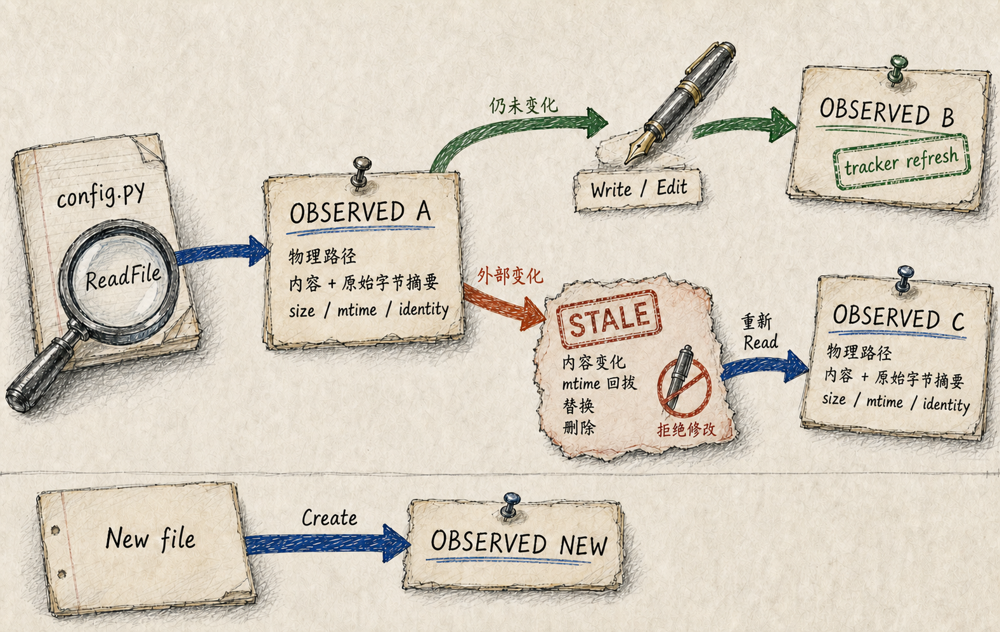
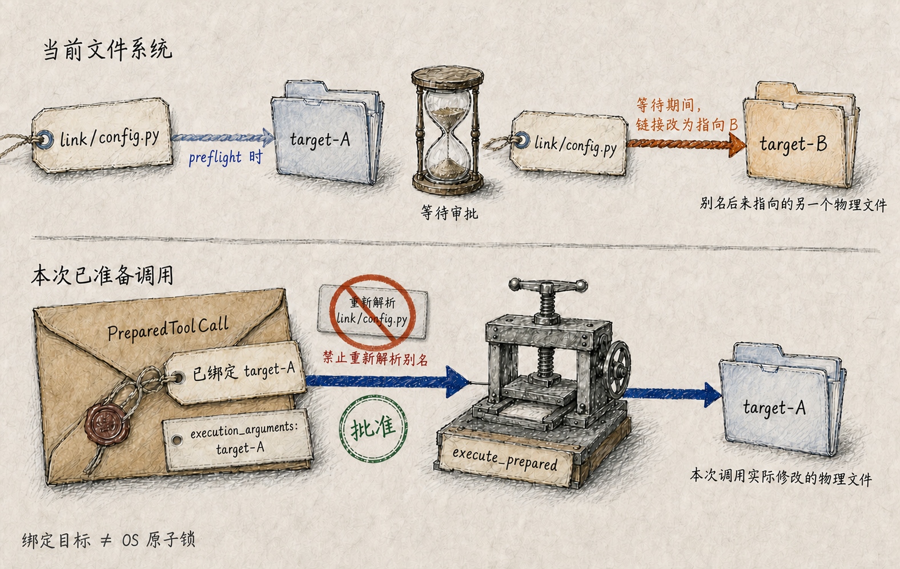

# 文件修改的事实门禁：只改动已读取且仍未变化的物理文件

假设 Agent 读取了 `config.py`，准备把其中一个值从 `false` 改为 `true`。就在读取之后，格式化器、另一个终端或用户本人修改了同一个文件；更隐蔽的情况是，文件内容变化后又被恢复了原来的修改时间，或者模型使用的路径其实是一个随后被改指的符号链接。

如果 Edit 只按路径重新打开文件并替换字符串，它可能覆盖用户的新内容，也可能在审批等待之后修改另一个物理文件。对 Coding Agent 来说，“路径看起来相同”并不足以构成修改依据。

UthCode 为文件副作用建立了两道相互配合的**事实门禁**：

1. Read 建立一个“我实际观察过哪个物理文件、当时内容是什么”的版本事实；
2. trusted preflight 把待执行动作绑定到审批时确定的物理目标，而不是保留可再次解释的路径别名。

只有观察版本仍然有效、执行目标仍然是同一个物理对象，Write 或 Edit 才能继续。

## 路径、物理目标和授权是三件事

模型给出的 `src/../config.py`、绝对路径或符号链接只是词法输入。`WorkspacePathResolver` 先把相对路径锚定到 Application workdir，再完成规范化和物理解析，得到最终目标及其 `ResourceScope`：

```text
模型路径
  ↓ lexical normalize
  ↓ physical resolve
物理目标 + INSIDE / OUTSIDE
```

Resolver 报告事实，但不替 Permission 做决定。当前实现并不把工作目录称为 Sandbox，也不永久禁止所有 `OUTSIDE` 目标。物理范围进入可信 `PermissionAction`，由 Control 层决定 Allow、Ask 或 Deny；相对路径仍以 workdir 为锚，外部目标仍必须被如实标记。

这条边界很重要：

- 路径解析回答“它实际指向哪里”；
- scope 回答“目标是否位于 workdir 内”；
- Permission 回答“这次动作能否执行”；
- FileReadTracker 回答“这个文件版本是否仍是 Agent 观察过的版本”。

任何一层都不能替代其他层。

## Read 建立的是完整文件版本事实

`ReadFile` 可以按 offset 和 limit 只向模型返回一页带行号文本，但成功读取时，Tracker 记录的是完整 UTF-8 文件状态，而不是当前页的摘要。

当前版本事实包含：

```text
规范化物理路径
文本内容 SHA-256
原始字节 SHA-256
文件大小
mtime_ns
设备 / inode 身份（平台可用时）
```

同时保留文本和原始字节摘要，是为了避免只比较解码后文本而漏掉字节变化；同时保留摘要和 stat，是为了识别内容变化、文件替换以及常见元数据变化。

写入前，Tracker 会重新 stat、重新读取字节和 UTF-8 文本，并逐项比较。下面这些情况都会使版本事实失效：

- Agent 从未通过 `ReadFile` 观察过现有文件；
- 文件内容发生变化；
- 内容变化后 mtime 被恢复；
- 文件被另一个 inode 替换；
- 文件被删除、变成目录、无法读取或无法按 UTF-8 解码。

所以 read-before-write 不是一句工作习惯，而是可验证的前置条件。

## Write 和 Edit 使用不同的版本规则

新文件没有可覆盖的旧版本，因此 `WriteFile` 可以直接创建并补齐父目录。已有文件则必须先有 Tracker 记录，并且当前状态与记录完全一致。

`EditFile` 的要求更严格：目标必须已读且未变化，`old_string` 必须非空并且只出现一次。它先验证版本，再读取待编辑内容，确认唯一命中后，在真正写入前再次检查 Tracker 和取消状态。

这个第二次检查缩短了“选择替换内容”和“执行写入”之间的陈旧窗口。它仍不是 OS 原子锁，但能避免 Runtime 在已经观察到变化后继续提交旧编辑。

成功 Write 或 Edit 后，Tracker 会立即刷新为新文件状态。这意味着 UthCode 自己刚刚完成的修改成为下一次修改的当前依据，不必为了连续的受控编辑机械地再次调用 Read。

可以把状态变化理解成：

```text
UNREAD
  └─ ReadFile 成功 → OBSERVED(version A)

OBSERVED(version A)
  ├─ 文件未变 + Write/Edit 成功 → OBSERVED(version B)
  └─ 外部变化 / 替换 / 删除     → STALE，拒绝副作用
```



`Glob` 找到一个文件、`Grep` 读到一行内容，都不等于建立可写版本。搜索工具没有接入 `FileReadTracker`；只有成功的 `ReadFile` 才表示 Agent 已经观察了完整文件。

## 审批等待期间不能重新解释路径

仅有版本摘要仍不够。考虑下面的时序：

```text
path = link/config.py
preflight 时 link → target-A
Permission 暂停等待用户
等待期间 link 改为 → target-B
用户批准
```



如果执行阶段重新解析原始 `link/config.py`，Permission 审批的是 A，实际修改的却是 B。即使 B 也在工作目录内，这仍然破坏了授权对象与执行对象的一致性。

因此文件工具在 preflight 中把物理路径写入 `ToolPreparation.execution_arguments`。`PreparedToolCall` 同时携带可信 Action 和这份不可变执行参数；恢复后，`execute_prepared` 直接使用已经绑定的物理目标，不再按原始别名重新选择文件。

Glob 和 Grep 采用同样原则：preflight 枚举并绑定经过物理验证的候选集合，执行阶段消费该集合，而不是在审批之后重新遍历一套可能变化的符号链接目标。

这解决的是**prepared 阶段后的别名漂移**，不是对所有操作系统竞态的万能证明。最终一次状态检查到系统调用之间仍可能存在极短 TOCTOU 窗口；UthCode 没有为普通文件修改伪造全局事务、仓库锁或 OS Sandbox。

## 工作区内并不自动等于可以修改

一个目标位于 `INSIDE`，只说明它的物理位置在 workdir 下。它可能仍然是敏感配置、用户刚修改的文件，或当前模式禁止写入的资源。

反过来，一个目标被标记为 `OUTSIDE`，也不表示 Resolver 无法解析它。正式路径会把这个事实交给 Permission；只有控制决策允许后，已准备的普通 Tool 才能执行。

所以不要把这套机制描述为“工作区沙箱”。更准确的关系是：

```text
physical resolution  保证资源身份真实
read-state gate      保证修改基于已观察版本
Permission           决定当前动作是否获准
```

文件事实门禁也不保存编辑历史、不生成版本 Diff、不替代 Git，更不是跨 Application 的全局状态。每次默认工具装配都会创建独立 Resolver 和 Tracker；三个文件工具在同一 Application 中共享它们，不同 Application 不共享“已经读过”的资格。

## 从路径硬边界到事实与控制分离

早期工具系统已经认识到两个关键风险：所有文件能力都要做物理路径检查，已有文件必须先读后改，而且不能只依赖 mtime 判断变化。当时工作区外目标由工具直接硬拒绝。

Permission 引入后，设计把“物理范围事实”和“是否允许执行”拆开：Resolver 负责给出 `INSIDE/OUTSIDE`，Control 决定能否继续，read-before-write 不变量保持不变。

后续验收又发现了更隐蔽的问题：preflight 虽然按物理目标生成了 Action，执行阶段却仍使用原始路径。符号链接在审批期间改指，就能让授权对象和实际对象分离。`ToolPreparation.execution_arguments` 因此成为准备协议的一部分，把物理目标和实际执行 payload 固定在一起。

这套机制最终回答的不是“如何写一个 Edit 工具”，而是一个更普遍的工程问题：

> 当 Agent 根据先前观察去修改外部状态时，Runtime 怎样证明观察仍然有效，并确保批准的对象就是实际发生副作用的对象。
