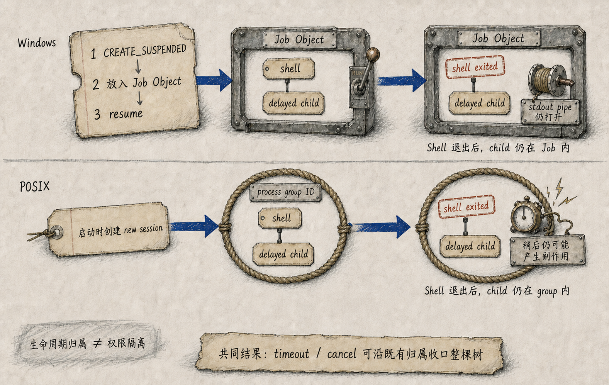
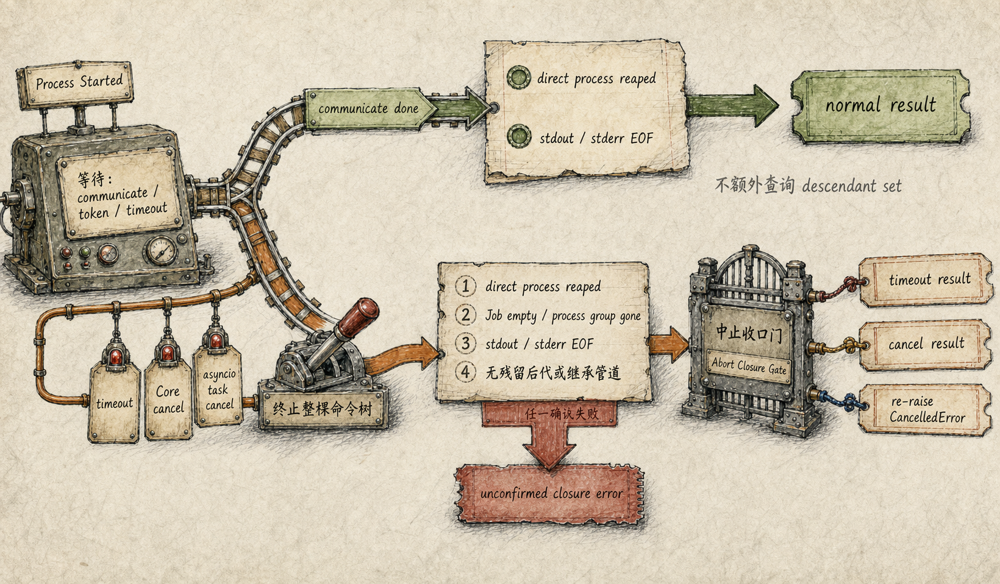

# Bash 中止收口：超时或取消返回前，先确认整棵命令树已经结束

一个命令超时后，父 Shell 已经退出，Runtime 也返回了 `command timed out`。几秒之后，工作目录里却出现了一个新文件。

这并不矛盾。Shell 可以启动子进程后提前结束；子进程仍然运行、仍然持有 stdout/stderr 管道，也仍然可以产生副作用。如果 Runtime 只观察直接进程的 return code，就会把“父进程结束”误报成“整条命令已经收口”。

UthCode 的 Bash Tool 因此不只保存一个进程对象，还为中止路径建立**命令树生命周期**：启动时建立平台级归属；正常完成以直接进程退出和继承的输出管道 EOF 为证据；超时或取消则必须进一步终止并确认进程树收口，最后才产生对应的 `ToolExecutionResult`。

## Bash 是进程执行，不是 Sandbox

`Bash` 这个名字表示 UthCode 的通用命令工具，不承诺所有平台都使用 POSIX Bash。它在 Application workdir 中调用当前操作系统 shell，并继承当前 OS 用户权限。

因此它明确属于 unsandboxed process execution：

- 不创建操作系统权限隔离；
- 不自动降权或提权；
- 不把工作目录边界变成进程文件访问边界；
- 不靠进程组或 Job Object 限制命令可以读取什么。

执行之前，trusted preflight 会分析可确定的 effect、scope、敏感事实和灾难性 circuit breaker，再由 Control 层决定 Allow、Ask 或 Deny。那回答的是“能不能启动”。本篇关心的是另一个问题：**一旦获准启动，Runtime 怎样知道它什么时候真正结束。**

## 为什么直接 Shell 不是完整生命周期

考虑一个命令树：

```text
UthCode
  └─ shell
      └─ parent script
          └─ delayed child
              ├─ 稍后写文件
              └─ 持有 stdout pipe
```

`parent script` 可以创建 child 后立即退出，Shell 也可能随之得到退出状态。此时直接 `process.returncode` 已经非空，但 child 仍属于这次命令的因果后果。

若 Runtime 只 kill 已退出的 PID，或者看到 return code 就跳过终止流程，会出现两种假收口：

1. 后代继续产生文件、网络或其他副作用；
2. 后代仍持有管道，`communicate()` 只能等它自然结束，所谓“一秒超时”实际拖到数秒。

所以命令生命周期必须有一个独立于直接 Shell return code 的所有者。

## 启动时就建立平台级归属

Windows 与 POSIX 提供的原语不同，但 UthCode 让它们表达同一个语义：后代即使在直接 Shell 退出后，仍然属于这次命令的生命周期控制对象。

### Windows：先加入 Job Object，再允许运行

Windows 路径先创建 Job Object，再以挂起状态启动 Shell。Shell 在执行任何用户命令之前被加入 Job Object，随后才恢复主线程。

这个顺序关闭了一个关键竞态：如果先让 Shell 运行、再按父 PID 建立归属，它可能在 Runtime 看见之前就创建子进程并退出。Job Object 从启动边界接管生命周期，终止时可以针对整个 Job，并查询活动进程是否已经归零。

### POSIX：独立 session 与 process group

POSIX 路径使用新的 session 启动 Shell，并保存原始 process group ID。后续收口不依赖 Shell 是否仍然存活，而是向原始进程组发送终止信号，并检查该组是否已经消失。

两种实现都不是安全沙箱。它们为 timeout/取消提供“哪些后代属于本次命令、怎样统一终止和确认”的生命周期控制，而不是“这些进程具有什么系统权限”。



## 正常完成与中止使用不同的完成证据

命令启动后，Runtime 同时等待：

```text
process.communicate()
Core CancellationToken
timeout deadline
```

如果 `communicate()` 先完成，当前实现以直接进程已经退出、继承的 stdout/stderr 管道到达 EOF 作为正常完成证据。它不会在这条正常分支上额外查询 Job Object 活动进程或 POSIX process group 是否为空。Runtime 随后根据退出码整理结果：标准输出和标准错误分区保留，无输出有明确表示，非零退出形成 Tool error。

如果 timeout 或 Core cancellation 先发生，Runtime 不会立即返回。它必须完成下面的顺序：

1. 请求平台生命周期控制对象终止整棵命令树；
2. 等待直接 Shell 回收；
3. 确认 Windows Job Object 活动进程归零，或 POSIX process group 消失；
4. 继续等待 `communicate()`，确认 stdout/stderr 管道也已收口。

只有这些条件都成立，Tool 才能诚实地返回“超时”或“已取消”。如果进程树或管道无法确认回收，结果会明确说明收口未确认，而不会把未知状态包装成普通成功或普通取消。

中止结果的规则可以写成：

```text
timeout / cancellation result
  requires
process-tree termination confirmed
  AND direct process reaped
  AND output pipes closed
```



## asyncio task cancellation 也不能绕过清理

Core `CancellationToken` 是产品级取消信号；外层 `asyncio.Task.cancel()` 则可能来自应用关闭、任务驱动异常或更上层的协程取消。二者语义不同，但都不能把子进程遗留在后台。

当 Bash 协程本身收到 `CancelledError` 时，它先执行同样的进程树终止和管道回收。确认收口后，再重新抛出 `CancelledError`，让上层保留原有 asyncio 取消语义；若无法确认收口，则抛出明确的生命周期失败。

清理阶段不能简单取消 `communicate()` 或关闭父侧管道来制造“已经结束”的假象。真正的成功条件仍然是后代与管道均已收口。

## 工具结果只报告已经确认的事实

Bash Tool 自己负责形成完整的 `ToolExecutionResult`，不在 Integration 层截断 stdout/stderr。之后，通用工具链再把执行 outcome 交给 Application 的结果物化策略：小结果 inline，大结果可以保存为 Session ref，保存失败也不能重新执行命令。

这两个阶段的责任不同：

```text
Bash lifecycle
  证明命令是否结束、退出状态是什么、输出是什么

Tool result materialization
  决定完整结果怎样进入下一次模型上下文
```

如果生命周期本身未知，不能用结果存储策略掩盖；如果生命周期已经完成但结果保存失败，也不能因为“模型没看到完整输出”而再次启动命令。

## 一次真实缺陷怎样修正了生命周期所有权

早期实现已经支持 workdir、stdout/stderr、timeout、取消和进程回收，但它曾把“直接 Shell 已有 return code”当成“命令树已经结束”。Windows 路径还依赖按 PID 调用树终止命令。

真实副作用测试暴露了问题：父进程创建一个延迟写标记文件的子进程后立即退出。timeout 先发生，但旧实现一直等到后代自然结束，最后返回 timeout，标记文件却真实存在。这个结果证明直接进程状态不能代表后代生命周期。

修正后的 Windows Job Object 和 POSIX process group 都把生命周期所有权从“一个 PID”提升为“一个命令归属集合”。测试分别覆盖 timeout、Core token cancellation 和 asyncio task cancellation，并在返回后的延迟窗口确认后代没有写出标记文件。

后来 Bash 又增加了 effect、scope、Guard facts 和 circuit breaker 分类，但那属于启动前的 Control 事实，不改变启动后的收口义务。无论权限模式怎样，获准运行的命令都必须满足相同的生命周期门禁。

这套机制最终坚持的是一句很朴素的话：

> Runtime 不能因为 timeout 或取消信号已经到达就立刻返回；它必须先确认命令树终止、直接进程回收和输出管道关闭，才有资格报告这次中止已经收口。
