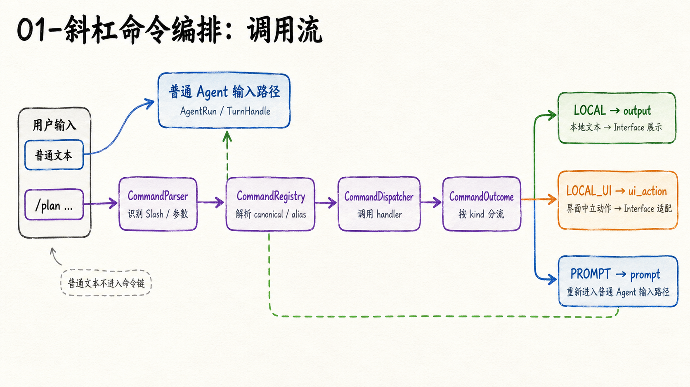
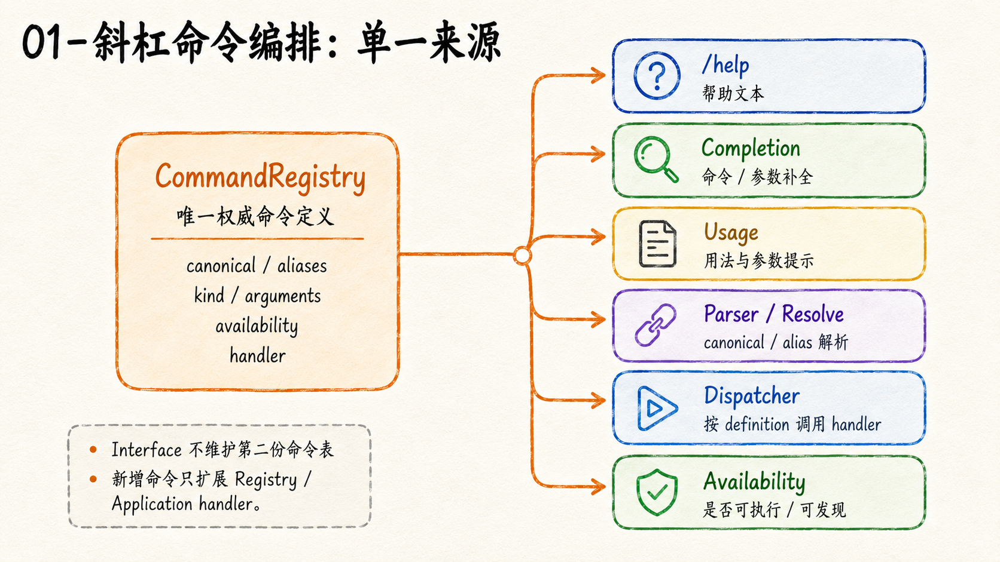

# 斜杠命令编排：把交互命令变成稳定的 Application 语义

在交互式 Coding Agent 里，`/model`、`/resume`、`/plan` 看起来都只是“输入框里以 `/` 开头的一段文字”。

最直接的实现，是让 TUI 在收到文本后写一串 `if/elif`：

```text
/model  → 打开模型选择器
/clear  → 清空界面
/quit   → 退出程序
```

这种写法一开始很快，但命令一多就会出现一个更难处理的问题：**谁才真正定义了这条命令的语义？**

如果 TUI 负责解析，Help 再维护一份命令列表，Completion 又维护一份候选，Application 只在某些分支里被调用，那么同一个 `/model` 很快就会拥有几份彼此不同的定义。更换界面技术时，这些业务规则还要跟着搬一次。

UthCode 把 Slash Command 放在编排层处理：**交互界面只提供输入和展示，命令的定义、解析与结构化结果属于 Application。**



## 一条命令不是一段特殊 Prompt

首先要分清两种输入。

普通文本，例如：

```text
帮我检查这段代码为什么会死锁
```

它应该进入当前 Agent Run / Turn 的正常输入路径，不需要先经过 Slash Command Dispatcher。

而：

```text
/model deepseek/default
```

表达的是一个应用级操作。它需要先被解释成“用户正在调用 `model` 命令，并提供了一个模型参数”，然后再决定应该查询 Application、返回界面动作，还是产生一段 Prompt。

因此 `CommandParser` 的第一项职责反而是**不误伤普通文本**。只有 Slash 输入才进入命令路径；裸 `/`、未知命令、参数错误和可执行调用也会被区分成不同的解析状态。

对于需要同时保留结构化参数和自然语言 query 的命令，Parser 还会把两者分开。结构化参数可以使用类似 shell 的引号规则解析，但用户写下的 query 不应该被拆开后重新拼接，否则原始表达可能发生变化。

## Registry 是命令语义的单一来源

真正避免命令系统逐渐分叉的关键，不是 Parser，而是 Registry。



每个 `CommandDefinition` 描述一条命令真正稳定的元数据，例如：

```text
canonical name
alias
kind
arguments
availability
handler
```

于是帮助、命令搜索、补全、Usage、别名解析和 Dispatcher 不再各自维护一张表，而是消费同一组定义。

这条边界尤其重要，因为“可发现”和“可执行”必须保持一致。假如 `/resume` 已经实现，但 Completion 仍从旧列表读取，它就可能真实可用却无法被用户发现；反过来，如果 Help 宣称一条命令存在，但 Dispatcher 根本不认识它，界面展示也就失去了可信度。

当前 UthCode 仍沿用这套机制。后续加入 `/permission`、`/new`、`/resume`、`/compact`、`/plan`、`/do` 等能力时，增加的是新的 Application handler 和结构化动作，而不是在 TUI 里再造一套命令系统。

当前 `/compact` 已进入同一 Application/Session use case：手动请求、自动 L4/L5 和 ordinary overflow recovery 共享 Context orchestrator、Hard Gate 与 terminal projection。Desktop 的 `/compact`、`/status` 和 typed interaction 仍通过 Bridge 消费 Application 投影；Renderer 不复制 Context、Session 或 Command authority。

## Dispatcher 只返回结构化结果

命令执行后，Application 不应该告诉界面“创建一个某某 Widget”。

那会让 Application 反过来依赖具体 UI 框架。

UthCode 的 `CommandOutcome` 把结果分成三类稳定语义：

```text
LOCAL
  → output
  → 返回本地文本

LOCAL_UI
  → ui_action
  → 返回界面中立的动作

PROMPT
  → prompt
  → 返回可以进入 Agent 路径的 Prompt
```

其中最值得注意的是 `ui_action`。

例如“清空当前可见 Transcript”“打开模型选择器”“会话已经切换”“选择 Behavior Mode”都可以用 UthCode 自己的结构化对象表达。它描述的是**用户想让界面发生什么**，而不是“调用 prompt_toolkit 的哪个类”。

于是同一个 Application 结果可以被不同 Interface 用不同方式实现：

```text
ClearTranscript
    ↓
TUI：清理当前界面投影
Web：清理页面中的可见消息
Desktop：重置对应视图
```

Application 不需要知道这些界面的具体控件。

## UI Action 不是 Agent 状态

这里还有一个容易混淆的边界。

`OpenSessionPicker` 可以要求界面打开 Session Picker，但 Session 本身不归 Picker 所有；`BehaviorModeSelected` 可以通知界面新的行为模式，但 Plan / Task 的权威状态也不在 TUI；`ClearTranscript` 更只改变用户看到的界面投影，不会删除 Session History。

也就是说：

```text
UiAction
= 一次界面意图

不是
= Agent 核心状态的副本
```

命令可以触发 Application 用例，也可以产生界面动作，但它本身不应该成为第二套 Session、Plan、Permission 或 Run 状态机。

这使 Slash Command 能随着 Agent 能力增长而扩展，同时不会把 Application 的状态所有权逐步搬进 TUI。

## 为什么这套结构能够继续演进

Slash Command 最早落地时，默认界面还是 Textual，普通请求也只是较早期的生成句柄。后来 UthCode 引入 Agent Run、Turn、Session、暂停恢复、Permission、Plan 与 Context，当前 TUI 也已经换成 `prompt_toolkit`。

变化很大，但命令主链仍然是：

```text
Slash 输入
   ↓
Parser
   ↓
Registry
   ↓
Dispatcher
   ↓
CommandOutcome / UiAction
   ↓
Interface 适配
```

这说明真正值得保留的不是某个菜单 Widget，而是**“命令语义属于 Application，界面只消费结构化结果”**这条边界。

如果继续向下理解为什么 TUI 可以整体替换而不重写 Agent 运行逻辑，可以阅读 [可替换交互层](./02-可替换交互层.md)。

当前代码事实可参考：[A04 Orchestration Context](../../context/A04-Orchestration/Orchestration-Context.md)。
