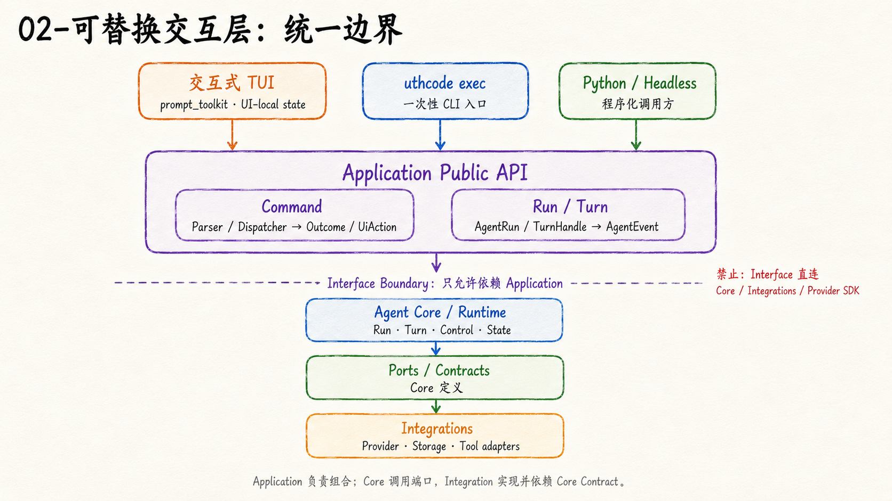
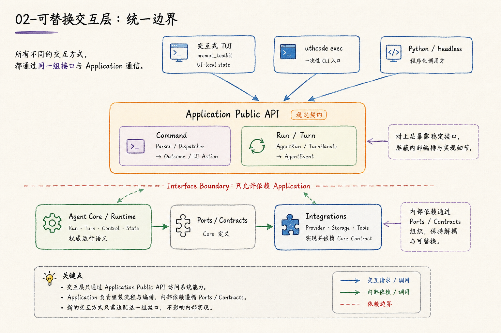

# 可替换交互层：为什么 TUI 不应该拥有 Agent 运行语义

一个 Coding Agent 最早只有 TUI 时，很容易让界面“顺手”多做一些事情：自己保存当前任务、自己判断能不能开始第二个 Turn、自己管理权限等待、自己拼 Provider 请求。

短期看，这些状态离输入框最近，放在 TUI 里似乎很自然。

问题会在第二种 Interface 出现时暴露出来。假如又需要：

```text
uthcode exec
Python Headless API
未来的 Web / Desktop / IDE
```

如果 TUI 已经拥有一套 Agent 状态机，新的入口要么复制它，要么直接依赖 TUI。前者会产生多份运行语义，后者则让“无界面运行”名存实亡。

UthCode 因此把 Interface 定位成**交互适配器**：它负责把人的输入翻译成 Application 调用，再把 Application 事件投影成人能理解的界面。



## Interface 负责“怎么交互”，Application 负责“发生什么”

当前交互式 TUI 会长期持有一个 `AgentRun`，但这个 Run 由 Application 创建。

TUI 启动时只创建内存中的 Run，不提前创建持久 Session；首条普通输入前才由 Application 惰性打开 Session。`/new` 和 `/resume` 是显式的 Session 用例，安全 replay 也由 Application 投影后交给界面，TUI 不读取 Session 文件或 Core History。

在 Run 空闲时，普通输入会启动新的 Turn；Turn 已经运行时，普通文本可以成为 Steering；如果当前正在等待 Ask User、Permission、Provider Retry 或 Plan Review 等 typed interaction，同一个输入区又会优先成为对当前 Turn 的响应。

从用户视角看，这些行为都发生在一个输入框里，但真正的运行语义并不由输入框决定。

可以把当前关系简化成：

```text
TUI 输入
  │
  ├─ Slash Command → Application Command
  ├─ idle 普通文本 → AgentRun.start_turn
  ├─ active 普通文本 → TurnHandle.steer
  └─ typed response → TurnHandle.resume / cancel
                         │
                         ▼
                    AgentEvent
                         │
                         ▼
                    TUI 投影
```

Interface 需要知道“当前该调用哪个公开用例”，但不应自己维护第二份 RunState、Tool Registry、Permission Store、PlanState 或 Provider。

## Headless 入口验证了这条边界是不是真的

只说“TUI 与 Core 解耦”还不够。

更强的验证是：**完全不导入 Interface tree，Application 仍然能够独立运行。**

`uthcode exec` 就是另一种 Interface。它为一次命令创建 Application、Run 和 Turn，消费同一类公开事件，只是把最终答案写到 stdout，把 reasoning、工具信息或失败写到 stderr。

它与 TUI 最大的产品差异，不在 Agent Loop，而在**响应通道**。

交互式 TUI 可以等待用户回答权限、Ask User 或 Plan Review；`exec` 没有这样的交互通道，因此一旦 Turn 需要 typed response，它只能让该 Turn 结束为失败，而不是偷偷在 CLI 里复制一套交互状态机。

这正是边界清晰之后的效果：

```text
相同：
Application / AgentRun / TurnHandle / AgentEvent

不同：
输入方式 / 展示方式 / 是否具备交互响应通道
```

## 哪些状态可以留在 TUI

“Interface 不拥有 Agent 语义”并不等于 TUI 完全无状态。

它仍然需要保存纯界面状态，例如：

```text
输入草稿
候选当前选中项
Picker 页码
临时 Markdown 预览
Esc 按键状态
终端布局
```

这些状态即使丢失，也不会改变“Agent 已经做了什么”。

相反，下面这些事实不能由 TUI 成为权威所有者：

```text
当前 Session 的持久历史
Run / Turn 生命周期
Permission 决策状态
Plan / Todo 权威状态
Tool 执行状态
Provider 身份与请求
Context / Timeline
```

判断方法很简单：

> 换成另一个 Interface 后，这个事实是否仍然必须保持同一个含义？

如果答案是“是”，它通常就不应该只活在某个 TUI Widget 里。

## 一次真实的界面替换说明了什么

T02 最初交付的是 Textual TUI。后来 UthCode 的终端交互实现已经切换到 `prompt_toolkit`，并改成主缓冲区、原生 scrollback 与新的输入/渲染策略。

如果 Agent 语义当时绑定在 Textual Widget 上，这种替换会迫使 Run、命令、Session 和取消逻辑一起重写。

实际演进并不是这样。



发生变化的是两类实现细节：

```text
Textual
→ prompt_toolkit

早期 GenerationHandle
→ 当前 AgentRun / TurnHandle / AgentEvent
```

但长期边界保持下来：

```text
Interface
   ↓
Application Public API
   ↓
Agent Core / Integrations
```

早期的生成句柄也没有被当成必须永久保留的 UI API。随着 Agent Loop、暂停恢复和长任务控制出现，它自然演进成更完整的 Run / Turn 合同。**稳定的是所有权边界，不是某一代类名。**

## 为什么禁止 Interface 直接碰 Core 与 Integration

这条限制并不是为了让目录看起来整齐。

如果 TUI 可以直接调用 Core ToolExecutor，Permission 很容易被旁路；如果它可以直接读取 Session Store，就会出现 Application 和 TUI 两个 Session 所有者；如果它持有 Provider SDK 对象，新的 Interface 又必须理解同一套厂商细节。

因此当前物理依赖明确保持：

```text
interfaces → application → core
                 │
                 ▼
            integrations → core
```

而下面这些方向被禁止：

```text
interfaces → core
interfaces → integrations
interfaces → Provider SDK
integrations → application / interfaces
```

新的 Interface 要做的是复用现有 Application 的 Command、Run、Turn 与 Event 合同，而不是复制 Agent Loop。

## 可替换的真正含义

“可替换 Interface”不是说所有界面行为完全一样。

TUI 可以有命令候选、模型 Picker 和实时流；`exec` 可以只有 stdin/stdout；未来 GUI 可以使用按钮和面板。它们的交互体验当然不同。

真正需要保持一致的是：

```text
谁拥有 Agent 状态
谁决定一次 Turn 如何运行
谁执行 Application 用例
谁只负责把结果展示给用户
```

只要这四个问题没有因为换 UI 技术而改变，Interface 才是真正可替换的。

Slash Command 正是这个边界中的一个具体例子，可继续阅读 [斜杠命令编排](./01-斜杠命令编排.md)。

当前代码事实可参考：[A04 Orchestration Context](../../context/A04-Orchestration/Orchestration-Context.md) 与 [TUI Context](../../context/TUI/README.md)。
