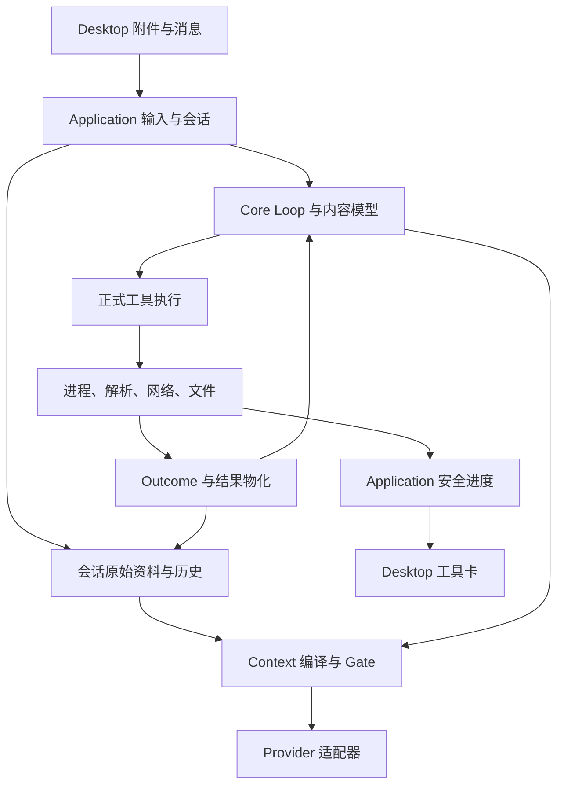

# T11-Agent能力补齐

## 1. 分析基线与当前实现

- 仓库：https://github.com/undertaker33/Re-UthCode
- 分支：`main`。
- 实际读取并在生成前复核的 Commit：`fa6b5b30f02fe7b5ce22f128b99f214ee90ba732`。
- 输入：`T11-Agent能力补齐-探索提示词.md`、项目来源中的任务书生成模板、用户对九项待定事项的最终决定。
- 本文是探索、用户决定和工程收敛后的任务书，不是已实施报告；未修改目标仓库，未运行 UthCode 测试、Windows PTY、真实 Provider 或收费搜索服务。
- 已读取根 `AGENTS.md`、`docs/README.md`、`docs/Context-Index.md`、`docs/rules/WorkPackageRules.md`、`docs/rules/UserDecisionBoundary.md`、`docs/OutstandingDebtList.md`，以及执行、控制、状态、编排和 GUI 当前事实文档。规则解释以本次已确认的修订为准。

以下路径相对于仓库根目录，均以以上 Commit 为分析基线。文档提供路由，代码提供当前事实。

| 证据路径 / 符号 | 当前事实与本次复用点 |
| --- | --- |
| `src/uthcode/core/provider.py`：`Message`、`MessagePart`、`ToolResultPart` | 已有 Text、Reasoning、ToolCall、ToolResult 分段；没有正式图片内容类型；ToolResult 内容仍为字符串。本次扩展原合同，不另建多模态 Runtime |
| `src/uthcode/core/tool.py`：`ToolExecutionOutcome`、`ToolResultMaterialization` | 已分离执行状态与结果持久化状态；工具返回仍主要是 content/is_error，缺少可供模型和截停机制消费的失败分类、副作用事实与进度合同 |
| `src/uthcode/application/tools.py`：`ApplicationToolService` | 组合工具、执行、脱敏和大结果物化；ToolResultRead/HistoryRead 接入已有正式路径 |
| `src/uthcode/integrations/tools/tool_result_read.py`；`tests/test_tool_result_persistence.py` | 已有 session-scoped ref、有界分页、配额与保存失败不重做副作用的合同测试；应扩展复用 |
| `src/uthcode/core/agent.py`：`AgentLoopConfig`、`AgentTurnExecution` | 默认 `max_iterations=50`，循环及 continuation 路径都有相关检查；已有 FIFO、取消、暂停、Provider retry、未知工具连续失败与完成阻断 |
| `src/uthcode/application/runs.py`：`AgentRun.start_turn`、`_TurnDriver` | 当前输入为字符串；一个 Run 同时一个 active Turn；driver 持有协程/队列，Core 持有领域状态 |
| `src/uthcode/integrations/tools/process_tools.py`：`BashTool`、`_start_process` | 当前 OS shell；默认 120 秒、最大 600 秒；communicate 后整批返回；Windows Job Object / POSIX process group 用于终止回收，未形成跨调用进程会话与 PTY |
| `tests/test_builtin_process_tool.py` | 已有 stdout/stderr、非零退出、中文解码、timeout/cancel 后后代进程回收测试；不是从零增加进程终止 |
| `src/uthcode/integrations/tools/search_tools.py`：`GlobTool`、`GrepTool` | 已有路径、glob、Python 正则和行号；固定跳过部分目录，候选与命中结果会汇集，需补忽略语义、二进制、有界执行和继续读取 |
| `src/uthcode/integrations/tools/file_tools.py`、`workspace.py`：`FileReadTracker` | 已有 ReadFile/WriteFile/EditFile 和先读后写、变化检测；Patch 必须接入相同路径与读取事实 |
| `src/uthcode/integrations/tools/factory.py` | 六个内置 Integration 工具为 ReadFile、WriteFile、EditFile、Glob、Grep、Bash；没有本次所需的正式 Web、文档、ViewImage、Patch 和 Git 查询工具 |
| `src/uthcode/integrations/providers/{anthropic,openai_responses,openai_compat}.py` | 三条 SDK 适配路径存在；Responses 的 user 输入按文本构造，function_call_output 使用字符串；图片必须进入真实序列化路径 |
| `src/uthcode/core/{history,context,compaction}.py`；`application/{sessions,context,request_preparation}.py` | 已有 Transcript/Timeline、Working Context、Gate、压缩和会话恢复；不是新增历史体系；图片引用、预算与压缩后再读取需接入原链 |
| `src/uthcode/interfaces/desktop/bridge.py`：`turn.start`、Session runtime 管理 | turn.start 仅接受 prompt；不同 Session 有独立运行时，导航保留后台 Turn，闲置后台运行时会关闭回收；存活子进程必须纳入回收判断 |
| `desktop/src/renderer/{Composer,SettingsView,settings-draft,ChatTimeline,safe-markdown}.tsx/.ts` | Composer 是文字入口；Settings 已有 Provider/Model、reasoning、窗口/输出上限、默认模型/权限；Markdown 的本地 URL 当前不会形成可打开链接 |
| `desktop/src/main.ts` | 已有受控 openPath 使用点，但不等于聊天产物链接和附件预览链已完成 |
| `src/uthcode/application/configuration.py`；`integrations/config/{loader,writer}.py` | Provider/Model 配置和受控秘密链已存在，允许字段明确；新搜索凭据必须显式拓展用户配置规则 |
| `eval/execution.py`：`run_attempt` | 已复用 Headless 正式运行链，导出安全事件、结果、诊断及工作区变化；复用这些边界，不建立第二套 Agent Loop |
| `pyproject.toml`、`desktop/packaging/uthcode-runtime.spec` | Python 3.12；anthropic>=0.117,<1、openai>=2.46,<3；当前依赖未包含本次文档/PTY/网页解析库，Windows 打包需要覆盖新增原生依赖 |

参考实现 OpenAI Codex 锁定为 `53ff712a48379ce8df605e292afd6046ca88ae9b`，实际读取 `codex-rs/core/src/tools/handlers/unified_exec.rs`、`view_image.rs`、`codex-rs/apply-patch/src/lib.rs`。仅采用进程句柄与后续读取、图片实际入模、结构化 Patch 等机制，不复制其完整平台架构。外部协议与依赖结论见第 6 节。

## 2. 问题、目标与范围

目标是让同一个正式 Agent 完成“接收截图或文件 → 定位代码和联网取证 → 修改 → 长进程验证 → 读取文字及视觉结果 → 交付本地文件”，并在正常工作时持续运行、出现可观察异常时截停。

### 2.1 原始能力逐项去向

| 原编号 | 本次交付与限定 | 行为 |
| --- | --- | --- |
| 1 多模态输入 | 图片/截图，三协议映射；音频、视频不纳入 | R01、R03、R04 |
| 2 Attachment 输入链 | Desktop 拖拽、粘贴图片、文件选择；会话副本、预览/移除、失败重发、恢复；Application 提供同等正式输入能力 | R01—R04 |
| 3 文件/文档解析 | PDF、DOCX、XLSX、PPTX 文字和基本结构；PDF 按页渲染后视觉读取；无独立 OCR、Office 编辑或排版复刻 | R05、R06 |
| 4 Web Search | 独立 Tavily 工具；用户配置、额度说明、来源、取消和受控失败 | R07、R08 |
| 5 Web Fetch | 本地请求公开 HTTP(S) HTML/纯文本/PDF；跳转、限量、正文和定位；不加入 JS 浏览器与登录自动化 | R09 |
| 6 Outcome / Failure | 扩展已有 Outcome，区分执行、副作用、保存、显示；失败分类与 retryable | R10、R11 |
| 7 Terminal / Process | pipe 与 PTY、stdin、读取/查询/终止、跨 Turn 同程序保留；Windows 正式支持 | R12—R15 |
| 8 增量输出 | Desktop 的缩略、折叠、分页和真实进度；TUI 不做新增实时日志展示 | R16、R17 |
| 9 Apply Patch | 文本文件增删改/移动，读取和权限检查，单文件提交、准确部分结果 | R18 |
| 10 Git Workspace | status/diff/log/show/branch 查询；不增加 Git 写专用工具，现有 Bash 权限语义继续适用 | R19 |
| 11 Settings | 查缺补漏和新增能力配置、用户/项目分层、生效边界；不机械暴露全部内部参数 | R20 |
| 12 Eval Adapter / Trace | 复用 Headless，输出 SWE-bench 预测 JSONL 和安全 trace，外部 harness 评分 | R21 |
| 13 异常截停 | 移除固定轮数终止；有证据的重复/循环、不可恢复错误与副作用未知触发；无异常可持续运行 | R22—R25 |
| 14 工具图片回传 | ViewImage、本地图片和 PDF 渲染页从 Tool 正式入模，与附件共享内容表达 | R06、R03、R04 |
| 15 文件发现/检索 | 复用 Glob/Grep，补有界执行、忽略规则、二进制处理和继续读取 | R26 |

横向闭环全部进入交付：大结果导航（R05/R09/R17/R26）、能力不可用反馈（R03/R08/R10）、产物打开（R27）、环境感知（R12）、修改验证（R28）、取消后的真实状态（R11/R15/R18/R24）。

本次不建设 Memory、Skill/MCP、Subagent/Multi-Agent、跨程序 Runtime Recovery、OS Sandbox、完整 LSP、语义索引、完整终端模拟器、浏览器/桌面自动化和通用 Artifact 平台。应用内读取与预览文件不等于新增完整 Office 编辑能力；PTY 不等于 xterm 式终端界面。已确认的 15 项按依赖顺序完成，不将其中一项静默推迟到另一任务。

## 3. 已确认决定与产品行为

### 3.1 最终决定

1. 首批图片与截图，不含音视频。
2. 四种文档文字和基本结构读取，PDF 可按页渲染供视觉模型观察；不建设独立 OCR。
3. 提交附件保存会话内副本，恢复和重发使用当时副本，原文件变化不修改已发送事实。
4. 当前真实请求包含图片而模型能力不支持或不能确认时阻止该请求，不丢图、不自动换模型、不自动文字降级。
5. Tavily 为首个独立搜索服务；允许用户级受控搜索凭据，明确修订原凭据位置约束；项目级仍不能提供凭据或重定向服务。
6. 进程在同一会话、同一程序生命周期内跨 Turn 保留，导航不终止；支持 PTY 和 stdin。程序退出和显式关闭所属运行时必须回收，不跨程序恢复。
7. Desktop 展示有界进程输出并做缩略、折叠等适配；Web/解析展示实际阶段/计数。TUI 不增加这套实时展示。
8. Git 正式能力只读；写操作仍经 Bash 与现有权限链。
9. 不以 50 轮或其他固定累计轮数作为硬上限。设计异常检测与截停；未触发异常且未完成/取消时可持续运行。不将原“预算耗尽后暂停并追加预算”的候选方案视为用户决定。

### 3.2 可观察行为

| 行为编号 | 场景与前置条件 | 输入或触发 | 预期行为与对外结果 | 状态变化 |
| --- | --- | --- | --- | --- |
| R01 | Desktop 会话可发送 | 粘贴图片、拖文件或选择附件，可只有附件没有文字 | 提交前显示文件卡/图片缩略，可移除；提交后从 Application 到 Core/Provider，不能只显示在 UI | 草稿资产绑定会话消息 |
| R02 | 已提交附件或发送失败 | 删除源文件、重发、重启恢复 | 已提交副本内容稳定；失败草稿可显式重试，不自动重复启动 Turn；未提交引用可回收 | 原始资料随会话保存 |
| R03 | 待发请求含图片 | 使用不支持/未声明图片能力模型、切换模型 | 明确拒绝受影响请求或切换；保持草稿/既有模型，不删除图片历史；图片已不在请求中时不因历史曾含图永久锁定模型 | 无静默降级 |
| R04 | 已有图像历史 | 后续 Turn、Context 编译、压缩、恢复 | 图片参与预算；压缩保存来源与可再次读取引用，原图不丢；实际 Provider 请求变小才算有效压缩 | 同 Session，原三重历史继续适用 |
| R05 | 文档在工作区或附件中 | 指定文件、页码/工作表范围/幻灯片/段落 | 返回有界结构与定位及后续读取入口；损坏/加密/不支持明确报错，未读部分不伪装已读 | 派生文本可重建 |
| R06 | 本地图片或 PDF 页 | ViewImage 或请求 PDF 页图 | 工具结果真实携带图片内容进入模型；保留文件/页定位；无视觉能力时明确不可用 | 每次 ToolCall 仍有终态结果 |
| R07 | 搜索已配置且权限允许 | 查询、结果数量/域名过滤 | Tavily 返回标题、URL、摘要、可用日期与用量；不把服务 answer 冒充原文；来源可继续 Fetch | 无隐式上传整个会话 |
| R08 | 服务未配置、限额、认证或网络失败 | Search/Fetch 调用 | 分类清楚；未配置工具不反复暴露为可用；429/额度不足不无界重试；取消关闭本地等待并说明远端计费状态不能撤回 | 不泄漏搜索 Key |
| R09 | 公开 URL | Fetch HTML/文本/PDF及重定向 | 本地有界下载，返回最终 URL/正文定位/继续读入口；动态或登录页明确限制，不启动浏览器 | 缓存不能替代原始来源事实 |
| R10 | 工具失败 | 参数、文件、网络、进程或依赖错误 | 返回稳定类别、retryable、副作用事实；模型可修正参数/改路径；Core 不用字符串猜失败 | 普通失败不直接崩整个 Run |
| R11 | 工具执行后 | 保存失败、输出截断、取消或 UI 显示失败 | 保留真实执行结果；保存/显示失败不导致重做写入；副作用未知停止自动继续 | 执行和保存/显示状态分离 |
| R12 | Agent 执行命令 | Bash 启动 pipe/PTY，指定工作目录 | 使用真实 Shell/OS；短等候后返回已退出或存活进程 ID、输出与状态；请求等待期限不等于进程寿命 | 进程登记到所属会话 |
| R13 | 同程序已有进程 | 后续调用、下一 Turn、切换会话后返回 | 能列出/读取/控制自己会话的进程，保留后台服务；其他会话不可拿 ID 控制它 | Application 保有资源所有权 |
| R14 | PTY 或可写 stdin 的进程 | 文本输入、EOF、终端尺寸 | 输入经权限链，输出可观察；PTY 标记为合并终端流，不伪造独立 stderr；没有 stdin/PTY 支持时明确失败 | 输入不因响应丢失自动重放 |
| R15 | 用户取消、停止或程序退出 | 取消 Turn、Process stop、shutdown | 取消/异常截停回收本 Turn 启动的存活进程；此前 Turn 保留的进程需显式停止；程序关闭回收所有所属进程；反馈确认/未知状态 | 不把取消等同无副作用 |
| R16 | Desktop 收到输出 | 长构建、测试、解析或抓取 | 工具卡默认缩略，能展开/折叠并继续读；后台事件归属原会话；不自动滚走用户正在读的位置 | Renderer 只持有有界显示状态 |
| R17 | 输出较大或持续产生 | 增量事件、读取游标、缓存淘汰 | 模型仅通过正式结果/读取获得选定内容；UI 增量不逐条追加到模型历史；游标过期明确报告最早可读位置 | 截断/保存失败可观察 |
| R18 | 模型修改文本文件 | ApplyPatch 增删改/移动 | 沿用读取与权限检查；预检失败不改动；提交中失败报告 changed/failed/not_applied；不覆盖新变化、不做全局回滚 | 单目标文件原子替换 |
| R19 | Git/非 Git 工作区 | status/diff/log/show/branch 查询 | 结构化或有界机器输出，显示未提交修改和 detached/unborn；非 Git 清楚反馈；无写/联网副作用 | 不创建分支、不提交 |
| R20 | Settings 编辑 | 配置搜索、图片能力、工具/Context 对外选项 | 复用 Application 校验写入；用户/项目来源清楚；当前或后台活动 Turn 使用既有快照，不被半途替换 | 新配置在安全边界生效 |
| R21 | 外部评测提供实例 | Headless 运行、生成 patch、导出 trace | 从正式 Application 运行；外部可读预测 JSONL；trace 不含凭据/原生载荷；评分交外部 harness | 每次实例独立工作目录与结果 |
| R22 | 正常长任务持续有进展 | 超过 50、100 或更多轮 | 不因累计轮数、累计 Token 或默认总时长停止；Context 单请求上限仍受 Gate 保护 | 有界检测状态不随轮数无限增长 |
| R23 | 重复/短周期无进展 | 相同失败或无效行动持续重现 | 先向模型注入一次具体纠偏反馈；相同异常继续发生后终止，给出安全证据及原因 | failed/runaway_detected |
| R24 | 副作用未知/致命失败 | 工具状态不明、持久化不可恢复等 | 不先纠偏重试未知副作用；闭合已发 ToolCall，停止后续执行，按 R15 收尾 | 明确 failed 原因 |
| R25 | 合法等待、重试、审批 | Process wait/长任务无输出/合法新证据 | 不用“没输出多久”判死循环；有界等待和工具自身超时继续可用；用户可随时取消 | 等待不产生虚假进展或失控证据 |
| R26 | 搜索较大代码库 | Glob/Grep，含忽略文件、二进制、结果超量 | 先定位后按范围读取；结果有路径/行号/截断/游标；不能先无限扫描/缓存全部结果再截断 | 正则超时受控返回 |
| R27 | Agent 交付文件 | 点击文件链接/卡片 | 可打开、定位；图片可预览；不存在文件局部提示；可执行文件默认定位而非直接执行 | 不让模型路径直接变成命令 |
| R28 | 修改验证闭环 | Patch → 测试/构建失败 → 读取 → 修复 → 重跑 | Agent 实际消费失败信息并完成修复；可查看生成图片，Desktop 可访问交付物 | 全链在正式 Application/Core |

## 4. 架构、协议与数据流

### 4.1 职责与状态所有者

保持 `interfaces → application → core`，Application 组合 integrations。SDK 类型、文件句柄、PTY、HTTP client、解析库留在 integrations；Core 只接收自身类型。

| 状态或操作 | 所有者 | 生命周期 / 边界 |
| --- | --- | --- |
| Attachment 草稿引用与用户提交意图 | Application 输入用例；Desktop 仅投影 | 从导入到提交/移除/取消；不得成为另一个消息库 |
| 原始附件/工具图片副本 | Application Session 经文件存储适配 | 会话内原始资料；不同于缩略图和派生缓存 |
| 图片、文件引用、工具失败/终态、异常检测事实 | Core 强类型模型；Loop 写 RunState | 随正式消息/Turn；检测状态是当前 Turn 有界内存 |
| 活进程和输出读取句柄 | 每会话 Application 组合的 Integration 实例 | 跨 Turn，截止显式关闭或程序结束；不是 Core RunState 中的 OS 句柄 |
| 进程输出 pump | integrations 产生观察数据，Application 路由 | 不主动调度 Agent；Turn 闭合后仍可更新进程日志状态 |
| Tool 进度、安全日志片段、产物 DTO | Application 公共出口 | 不含 SDK 载荷/秘密；Desktop 消费，TUI 可忽略新增进度事件 |
| Provider/搜索可信配置 | 用户级配置与 SecretValue | 项目只能使用允许的非秘密覆盖，不可重定向 |

### 4.2 内容与附件

在现有 MessagePart 中新增图片和文件引用；工具结果改为可携带文字、图片、来源引用的内容序列，替换字符串唯一载荷的假设，不维护新旧两套执行路径。TextPart、ReasoningPart、ToolCallPart 原语义继续保留。

最小内容字段：

| 内容 | 必要字段和语义 |
| --- | --- |
| 图片 | `asset_ref`、实际 MIME、width/height；引用同会话固定原图，detail/降采样选择留在适配层；不把 base64 放入日志或状态投影 |
| 文件附件 | `asset_ref`、display_name、MIME、size_bytes；Provider 可见文本描述和解析工具定位，不直接把四种 Office 二进制发给模型 |
| 来源 | 文件路径/asset_ref 加 page、sheet/range、slide 或 paragraph/table 编号；网页为请求 URL、最终 URL 和正文位置；不建跨类型复杂来源图 |
| ToolResult | 保留 tool_call_id、is_error；内容序列之外保留 execution/failure/materialization 元数据 |

Desktop 导入附件经 Main 读取选中文件或粘贴字节，由 Application 校验并形成固定副本；不把任意路径直接交 Renderer 读取。导入到提交之间持有受限临时副本，正式提交只绑定引用，避免先全量解析阻塞用户发送。文件读取失败/过大时保持可编辑草稿，不生成假成功 Turn。

已提交源副本不能按普通缓存淘汰。缩略图、解析结果、渲染页可按源引用和转换参数重建并采用有界缓存；无引用导入临时文件及时清理。不得为 T11 建全局跨会话 GC、内容寻址共享库、迁移平台或完整性证明链。复用现有 Session writer 和最小原子写入；副本就绪后才能提交引用，提交失败遗留无引用文件可正常清理。

新增 `start_turn` 输入合同同时接受文字和附件引用，更新全部生产调用方；文本接口从字符串构造同一输入值，不建立 legacy Runtime。Steering 同样使用正式内容输入；已有 pending interaction 期间的输入限制继续生效，不伪造另一个 Turn。补齐只有附件的首条消息标题/预览回退和已提交附件在历史分页中的展示。

### 4.3 三协议、能力判断与 Context

| 协议 | 用户图片 | 工具图片 |
| --- | --- | --- |
| Anthropic Messages | image block，Integration 从 asset_ref 解析为受支持来源 | 同 tool_use_id 的 tool_result.content 内文字/图片块 |
| OpenAI Responses | input_image，保留文字与图片顺序 | function_call_output 的图片/文字对象数组；遵守实际 SDK schema |
| OpenAI-compatible Chat Completions | user.content 中 text/image_url | 标准 tool 消息闭合文本结果，随后由适配器输出标有 tool_call_id/来源的 user 图片载荷；它是 wire 投影，不在 Core 历史冒充用户新指令 |

Compatible 不承诺任意服务都支持图片，更不能据“可调用 Chat Completions”就判支持。Model Profile 增加明确的图片输入能力声明；未知按不支持图片处理。端点差异只在 Integration；不在 Core 按服务商名称分支。真实验收需记录具体服务、端点、模型及 SDK 版本，至少验证一个支持图片的 compatible 服务。契约测试使用项目依赖范围内真实 SDK 参数结构；不能只 Mock 掉序列化后宣称三协议可用。

能力检查发生在真实待发请求上，包括历史恢复和模型切换的 prospective request；若当前工作上下文还含图，切换不支持图的模型应拒绝并保持原配置。若图已由正常 Context 压缩退出当前请求，原历史仍保留，允许使用文字模型；后续显式 ViewImage 得到不可用反馈。不得为了完成切换暗中压缩/删图。

图片不按 base64 字符数估算 Token，也不当作 0。优先 Provider count；否则 Integration 给出有来源、含图片保守开销的 estimate。图片尺寸、数量、请求字节上限与 Token Gate 分开校验。无法取得可用估计时明确 unavailable/请求不可安全构造，不伪装 exact。沿用现有 256K profile，不借本次重调文字压缩参数。

Transcript 序列化和反序列化、工具图片回放、Context Compiler 和普通请求都识别新增内容。压缩时将图像来源/asset_ref 保留到摘要的结构化关联中，正文明确视觉内容已压缩；需要视觉细节时重新 ViewImage。压缩用模型支持图片时可在有界 subpass 观察；不得在无图像证据时生成“看到了图”的描述。沿用 F03 的真实 Working Context 缩减判据及原子覆盖规则，不复制多 Turn 总摘要。

当前 Session v3 若新增记录需要提高 schema，执行结构变化所必需的一次数据迁移，旧文字记录转换为新统一载荷；不删除既有会话，不保留长期双读/双写兼容层。历史的 max_iterations 失败记录只作为历史事实迁移/回放，不重新赋予新 Loop 上限。

### 4.4 文件解析和图片读取

使用一个正式文档读取工具承载 `source`、`mode`、范围和结果预算；工具名称可定为 `ReadDocument`，`ViewImage` 独立存在。source 可以是受权限检查的文件路径或本会话 asset_ref。

| 格式 | 首批最小准确输出 | 范围读取 |
| --- | --- | --- |
| PDF | 按页文字、总页数、无文字页提示；页面渲染为图片 | page_start/page_end；图像模式一次有界页数 |
| DOCX | 文档顺序中的段落、标题与表格；明确不保证浮动对象/修订内容完整 | paragraph/table 或统一 block 范围，不编造分页 |
| XLSX | 工作表目录、单元格地址、值/公式表达与可用缓存值；不执行宏、不重算公式 | sheet + cell range/行范围；缺失缓存不能伪报计算值 |
| PPTX | 幻灯片顺序、文本和基本表格；说明嵌图未转写 | slide 范围；不承诺 PPT 原样渲染 |

默认先返回目录/摘要和一段有界正文；大文件不全部塞进 Prompt。派生文本可复用 ToolResultRead；格式范围仍作为主要定位方式。PDF 无文本页给出“可按页视觉读取”入口，当前模型不支持图片时明确限制，不接第三方 OCR 自动外发。解析器不直接调用任何模型 SDK；视觉理解走同一 Agent/Provider。

PDFium 调用不得跨线程同时进行。采用私有受控执行边界串行使用 PDFium，昂贵解析/渲染需要可取消时用可回收子进程；这不是新任务调度系统。解析取消、单次时间/字节/页数限制通过工具失败合同返回，不阻塞 Bridge 和用户取消。

### 4.5 工具 Outcome、权限和增量

扩展已有 ToolExecutionResult/Outcome，不重建 Outcome 子系统。至少携带：

- `failure.kind`：invalid_input、not_found、permission_denied、process_failed、timeout、network_error、unavailable、cancelled、side_effect_unknown；按真实需要补充 unsupported、conflict、resource_limit。字段允许表达当前已知事实，不用分类数量作为交付目标。
- `failure.retryable`：表示同条件再次执行是否可能恢复，不等于重试授权。参数错误可由模型修正后新调用；写入/输入/远端调用不会因 retryable 自动重做。
- `side_effect`：none / applied / partial / unknown；附最小资源/已变化范围或 process_id。执行 status 和 side_effect 分别表达，例如命令取消但文件已部分变化。
- 进程结果含 process_id、process_state、exit_code、stream 模式、输出游标；ToolCall 成功启动存活进程时该 ToolCall 已完成，不能称“工具还悬空”。
- 持久化保留 existing persistence_status/ref/error_code，显示失败留在观察端，均不得覆盖执行成功事实。

FIFO 和每个 ToolCall 一个终态 ToolResult 不变。批中遇到未知副作用立即停止后续执行，尚未执行的调用按顺序补受控 not_executed 原因；完成结果闭合及可确认持久化后终止 Turn。执行状态 unknown 不能仅因文字含“cancelled”被归为无副作用取消。

进度是观察，不改变 RunState。Tool 接受受限进度出口；Integration 发出阶段/计数或输出数据，Application 执行脱敏/限量、附归属身份，再送 Interface。普通 tool_started/tool_finished 保留；新增进度与日志事件不得携带工具原始参数、文件写入正文、SDK 原生对象或秘密。

用户已授权对原“工具事件不含正文”作窄修订：允许有界的受控 stdout/stderr/terminal 片段及明确请求的文档/图片预览；不开放所有 Tool 原始结果。复用现有 SecretValue/脱敏能力；需要处理秘密跨 chunk 分割，先保留短尾并脱敏后再发送，不能逐 chunk 直接替换。不得声称能够识别外部程序自行打印的一切未知敏感信息。

### 4.6 进程会话与 PTY

扩展现有 Bash 为唯一启动入口，增加有限等待、PTY 与工作目录参数；增加一个后续进程控制工具（例如 `Process`）执行 `list/read/write/stop/resize`。读操作为 READ；write/resize/stop 分别生成可信 PermissionAction。写 stdin 可能在交互 Shell 执行任意命令，必须按执行输入处理，不能因原启动已获批而无限获得新输入授权；无法可靠分类时 UNKNOWN，遵守现有 policy。进程 ID 只在当前 Application/Session 中解析。

最小合同：

| 操作 | 输入 | 返回 |
| --- | --- | --- |
| Bash | command、cwd、pty、yield_time_ms、可选 timeout_seconds | process_id、running/exited、输出片段/next_cursor、已退出时 exit_code |
| Process list | 当前会话 | 存活进程及有界已退出记录，安全命令摘要、启动 Turn、Shell/cwd |
| Process read | process_id、cursor、wait_ms、max_bytes | 新输出、最早/下一游标、gap/has_more、状态/退出码；无输出仍允许合法等待 |
| Process write | process_id、text 或 EOF | 输入是否已接受、字节数量、当前状态；不把原输入回显进事件 |
| Process stop | process_id | 已停止且回收确认，或终止状态未知；已退出时幂等返回 |
| Process resize | process_id、rows、cols | PTY 更新结果；pipe 明确不支持 |

`yield_time_ms`/read wait 只是本次工具等待期限；到期返回 running，不杀进程。`timeout_seconds` 若用户/工具明确给出才作为进程寿命期限，到期终止并报告；长进程默认无总寿命上限。网络/解析等单次 I/O 超时仍存在，不能用移除 50 轮上限取消一切资源约束。

pipe 模式分 stdout/stderr，PTY 返回单一 terminal 流。进程可跨 Turn，跨 Session 禁止控制；导航不关闭有活进程的 Application。成功 Turn 后存活进程继续保留；取消和异常截停停止本 Turn 启动的进程，此前 Turn 的保留进程通过显式 stop 管理。shutdown 先停止全部子进程和输出 pump，再关闭 Session writer。运行时崩溃后的历史日志仍可读，旧 process_id 只可显示为不可恢复，绝不自动重启命令。

Windows 使用 ConPTY（通过 pywinpty），POSIX 使用 ptyprocess；pipe 路径复用既有控制逻辑。必须保持现有 Job Object / process-group 的后代回收目标。PTY 依赖不提供安全创建/回收组合时，可在 integrations 加一个最小私有进程宿主：宿主先处于受控 Job，再启动实际 PTY 命令，防止“用户命令已运行后才追挂 Job”的竞态。它只解决 OS 资源归属与阻塞读，不是另一个 Agent Runtime；取消既要终止进程，也要解阻塞读取并等待资源退出。Windows packaged 验收验证实际后代与句柄收尾，不能以 POSIX 或 Mock 结果代替。

进程原始输出采用有界 spool/ring，内存和磁盘均有配额；到限继续 drain，明确记录截断区间，不能因停止读取 stdout 反向卡住子进程。退出后将保留日志按既有工具结果存储方式封口供恢复读取；日志保存失败不把进程重启。终态进程的内存记录应正常淘汰，存活句柄不能按日志缓存规则清除。

### 4.7 Desktop 与产物

Desktop 的工具卡有标题、阶段/状态、默认有界尾部、展开/折叠、继续读取、退出码和截断提示；不为每个 chunk 新建聊天消息。日志事件用 project_key/session_id/process_id 和单调序号归属，不将原 Turn 结束后的进程输出伪造为新的 Turn 事件。后台进程输出由会话 Application 观察出口路由，UI 导航不停止输出消费。

预览按需加载：图片用缩略图卡，原图点击查看；文档先显示文件卡及结构摘要。UI 不直接渲染终端 escape 控制为 HTML，PTY 最小显示做安全文本/回车行更新，过滤 OSC 等控制；不开发完整终端模拟器。用户可在 Desktop 查看/停止所属进程，Agent 的 stdin 操作继续经工具链，不额外增加绕过权限的自由终端入口。

产物引用通过 Application 校验文件存在与所属工作目录/已授权外部路径，再由 Main 执行打开或定位。图片支持受控预览；Office 文件使用系统打开；可执行文件默认定位，不因模型给出路径就执行。禁止将任意模型 URI、Shell 命令或 HTML 变成 Main 执行请求。链接不存在/不支持是局部显示错误，不重跑 Agent。

TUI 仅更新必要的输入/事件类型兼容调用和终态原因显示，忽略新增工具进度；不增加工具卡、实时日志、缩略图或折叠界面。这里的类型接入是同一正式合同，不保留旧接口双轨。

### 4.8 Web、Git、检索与 Patch

**Web。** Search 由本机 Integration 调 Tavily；只发送 query 及显式搜索参数。默认 basic、include_answer=false，不打开自动升级深度/研究模式；按 API 返回保留用量。未配置时在工具集合/环境事实中明确不可用；当前集合按 Turn 快照，错误不触发动态工具注册平台。Fetch 由本机 HTTP client 请求明确 URL，带响应字节与时间界限、显式逐跳处理；仅 HTTP(S)，不携带用户浏览器 Cookie，不自动登录。每次请求的 URL/重定向目标属于权限 action 的外部资源，外网跳内网/localhost 需按新的实际目标重新决策；不把 HTTP GET 泛称无外部副作用。正文采用本地提取，保留最终 URL、标题、获取时间和行/段落定位；PDF 下载复用 ReadDocument。普通静态抓取失败不自动切成第三方浏览器服务。

**搜索凭据。** 用户配置增加 `search` 表，含 enabled、provider=tavily、api_key；API key 仍用 literal/env: 表达并转换为 SecretValue。T11 固定官方 Tavily 端点，不给项目配置搜索 Key、端点、认证 header、环境覆盖或代理重定向入口。项目可禁用搜索/收紧结果或资源限制；不得自动启用用户未配置的服务。更新 AGENTS 与配置手册中“密钥仅在 Provider”的文字为 Provider 或已批准 search API 边界，保留其余脱敏/禁止进入历史要求。

**Git。** 使用机器可解析 status porcelain（NUL 分隔），diff/log/show/branch 为有界查询；argv 执行，不拼不可信 Shell 字符串。diff/show 禁止外部 diff/textconv 执行，避免“只读”查询启动外部程序；路径使用参数分隔，处理非 Git、未提交/未跟踪、detached 和无首个提交。查询不 fetch，不做索引写入或修复；不建 Git 写专用工具。

**Glob/Grep。** 保留现有工具名称、路径 resolver、scope 和权限前置；用成熟 gitignore 匹配库处理 .gitignore/.ignore，默认忽略依赖/缓存和二进制，明确 include_ignored/include_hidden 的行为。保留 Python 正则可表达性，利用项目已有 regex 依赖的匹配超时，避免引入第二套正则方言或必须分发 rg。文件迭代与结果产出按页受限，超量返回游标；游标关联检索条件，工作区变化不承诺全局快照，但不能悄悄复用不匹配查询。敏感/外部路径权限和 symlink 目标绑定沿用已测试事实；分页时才读取的新候选仍经过相同前置，不以优化绕过 Guard。内部实现若采用 ripgrep，必须先证明权限和 regex 合同等价，否则不替换。

**ApplyPatch。** 使用 Codex 风格 Begin/End Patch、Add/Update/Delete、Move to 及上下文 hunk 文本方言；不承诺 binary/git binary patch。已有文件修改/删除/移动继续要求成功读取并且未变化，新增不能覆盖现有目标。全 patch 先完成语法、目标、读取状态和授权预检；提交按目标顺序，单文件用原子替换。预检失败零变更；提交时再次校验，外部变化导致冲突，报告已变更和未执行范围；不为跨文件回滚建事务日志。移动创建目标和删除源若部分成功必须分别报告，不声称跨两路径原子。更新 FileReadTracker，EditFile 保留用于唯一字符串替换。

### 4.9 异常截停：取代固定轮数

本节是用户第 9 项目标的具体工程实现，不再保留 `max_iterations=50`，也不换成 500/1000、隐藏总 Token 上限或默认总运行时限。iteration_count/usage 继续统计，单请求 Context/输出上限、单批过大保护、未知工具保护、I/O 超时与用户取消继续生效。

**检测只依赖当前可观察事实。** 在 Core 的固定边界执行，不建外部监工 Agent、后台总结代理、通用规则引擎或循环检测插件系统。维护最近有限窗口的行动签名、结果签名、纠偏阶段和少量计数；状态归 Loop，仅当前 Turn 使用。签名来自规范化参数与语义结果，忽略工具 ID/真实 schema 中纯传输时间字段；不导出原始参数或秘密，不把所有时间数字随意删掉。

首批覆盖三类可验证异常：

| 异常 | 证据与初始工程阈值 | 行为 |
| --- | --- | --- |
| 同一失败反复执行 | 相同调用语义 + 相同失败类别/结果，连续 3 次且没有新输入/新有效结果 | 发送一次明确纠偏；反馈后同异常再连续 2 次则截停 |
| 短周期空转 | 长度 1—4 的动作/结果序列完整重复 3 个周期，期间没有有效状态变化；最近最多保留 24 个观察项 | 发送一次指出重复步骤的反馈；反馈后同周期再重复 2 次则截停 |
| 完成阻断空转 | 相同 Todo/Plan 未完成事实下重复尝试 final，连续 3 次且未执行有效工作 | 一次纠偏；之后重复 2 次则截停，不因换一段 final 文案重置证据 |

这些次数衡量同一个异常模式，不是正常运行总轮数上限；阈值可在有正反例证据时由本地代理调整并记录理由，不改变“仅异常截停”的产品语义。不能只检查连续相同工具名，也不能将测试失败后编辑代码再测试判成重复错误。

有效变化包括新用户输入、不同读取内容/来源位置、工具确认文件变化、实际任务状态变化、进程新输出/终态变化。心跳、计时、同一内容重写、无效 Todo 重写、仅模型宣称“取得进展”均不作为进展。新证据解除当前异常怀疑；检测缓冲有界，不保存全部历史作比较。

Process read/wait 是显式合法等待：同一存活进程、相同 cursor、无新输出不计入重复行动截停；等待调用强制实际有界等候，防止模型零等待高速轮询。Bash 中对真实状态的轮询若无法从语义结果确认是空转，不以无输出或总时长自动判死；通过工具描述引导使用 Process 正式等待。等待不产生虚假进展。普通权限/AskUser/Provider retry 等暂停期间不推进检测；人工确认重试形成明确新控制输入。

纠偏通过现有 RuntimeFeedback/动态上下文出口，包含异常类别、重复操作安全摘要、需要获取新证据/改变方法的提示，不擅自授权另一工具。纠偏本身不清除异常证据。检测在结果闭合后判定；若决定不执行当前批剩余工具，按 FIFO 补受控结果后退出。

截停沿用现有 failed Turn 终态，增加 `runaway_detected` 及安全原因/证据计数投影；用户可在同 Session 用新 Turn 继续，不自动重放旧工具，不新增一套持久暂停体系。副作用 unknown 不进入纠偏试错：立即以明确原因终止自动推进；持久化/Provider 致命失败继续复用既有合同。取消不是 runaway。

资源计量继续可见，usage 缺失显示 unknown 而不是零成本。外部 Eval/harness 可主动设置自身 deadline/费用约束并显式取消，但这个限制不得回灌成普通 Agent 的默认上限。T11 不新增必须消耗到某个累计预算就停止的产品机制。

### 4.10 Settings 与评测出口

Settings 复用现有 Provider/Model 编辑，不重复建设已有 reasoning/window/max_output 项。本次补：模型图片能力声明、搜索配置及 Key 受控编辑、工具单次超时/输出限量/附件限量等用户有实际作用的选项；Context 显示 configured/effective/source，保持现有冻结 profile。内部重复检测窗口、私有日志实现常量不机械暴露。

普通配置保持默认→用户→项目合并，项目只允许非秘密字段且不能放宽已明确限制。保存之前校验配置完整性；当前或任何受影响后台 Turn/Compact 活动时禁止替换其生效快照。保存的新配置用于下一安全边界；已有活进程使用启动参数，不因保存 Settings 重启或更换 Shell。UI 清楚显示生效时机与来源，不后台切换模型或搜索端点。

Eval 在已有 execution/export 基础上增加 SWE-bench 薄适配，输入为 instance_id、problem_statement、外部准备好的基线工作目录、模型配置引用和输出目录。模型只获取题面与允许工作区，不读取 gold patch/评分测试答案。通过同一个 Application 工具链运行，输出 `{instance_id, model_name_or_path, model_patch}` JSONL；patch 来自该实例基线的实际 diff，处理新文件，不能取模型 final 当 patch。实例工作目录由外部准备，评分容器与评分逻辑归 SWE-bench harness，不加入本项目的 Sandbox。

trace 复用现有脱敏 events/turn_result/diagnostics，只新增工具类别、进程生命周期、异常截停原因、模型/搜索用量等必要事实。默认不导出附件字节、搜索 Key、Provider native payload、原始 stdout 或全文 ToolResult。先用一个真实 SWE-bench Lite 实例接通运行→预测→官方 harness 评分，记录实际评分而非要求必然解题成功；接口可用与模型效果分开判断。不得把随机样例通过率变成整个 T11 的 pytest 红绿门槛。

## 5. 文件级改动与现有能力影响

下表按真实职责组合文件；新增路径是本任务计划，不冒充当前存在。私有拆分可在本地核对代码后调整，但不可改变第 3、4 节公共语义，不按一个类型一个文件组织，不为新功能复制另一套 Registry/Runtime。

| 编号 | 路径 | 操作与具体改动 | 接入或替换关系 | 行为 |
| --- | --- | --- | --- | --- |
| F01 | `src/uthcode/core/provider.py` | 扩展图片/文件引用和 ToolResult 内容序列；JSON round-trip；更新 Message 校验 | 统一替换文本唯一假设；保留身份和 native item 隔离 | R01—R06、R10 |
| F02 | `src/uthcode/core/tool.py`、`application/tools.py` | 失败结构、副作用、进度出口；物化与脱敏；新工具注册组合 | 复用 Outcome、Executor、materializer，去除字符串解析失败语义 | R10、R11、R16、R17 |
| F03 | `src/uthcode/core/agent.py`、`core/agent_events.py`、`application/runs.py` | 新输入值、闭合终态、工具进度路由、移除累计轮数 gate；有限异常检测和失败原因 | Loop 仍唯一状态写者，复用 RuntimeFeedback 与 Turn driver | R01、R10—R17、R22—R25 |
| F04 | `src/uthcode/core/history.py`、`core/context.py`、`core/compaction.py` | 新内容序列化、引用覆盖、预算计量和压缩来源保留 | 复用原三重历史、语义单元和实际缩减验证 | R02—R04 |
| F05 | `src/uthcode/application/sessions.py`、`integrations/session_files.py` | 会话附件绑定、恢复、结构必要迁移；文件/图片 replay；日志 ref 接入 | Session store 保持权威，原始资料与缓存明确区分 | R02、R04、R13、R17 |
| F06 | `src/uthcode/application/context.py`、`request_preparation.py`、`generation.py` | 图片能力/计量预检、真实请求组装、模型切换候选验证、关闭资源 | 不改成 UI 预算，不新增平行 Context 编译器 | R03、R04、R15、R20 |
| F07 | `src/uthcode/integrations/providers/anthropic.py`、`openai_responses.py`、`openai_compat.py` | 用户/工具图片的序列化与计量适配，支持失败明确映射 | SDK 留 Integration；compatible 图片追加仅为 wire 投影 | R03、R04、R06 |
| F08 | 新增 `src/uthcode/application/attachments.py`、`integrations/attachment_files.py` | 导入/提交/移除用例、固定副本、受控原图读取、缩略图与无引用临时清理 | 由 Session/正式 Application 组合；不建通用 Artifact Store | R01—R06、R27 |
| F09 | 新增 `src/uthcode/integrations/tools/document_tools.py`、`image_tools.py` | ReadDocument、ViewImage；四格式定位与有界读取、PDF 页图 | 共享 asset_ref 和既有权限/物化链，解析器不直接调模型 | R05、R06 |
| F10 | `src/uthcode/integrations/tools/process_tools.py`；必要时新增同目录 `process_sessions.py` | Bash 复用分类；进程句柄、pipe/PTY、输出 pump、stdin/stop；私有 OS 适配 | 替换 communicate-only 执行，保留后代回收能力；不改为 terminal UI | R12—R17、R25 |
| F11 | `src/uthcode/application/runtime_context.py`、`application/generation.py` | 发布真实 shell/OS/cwd 与进程安全状态；关闭流程覆盖活进程 | 不探测未授权网络或环境秘密；同步 close 可在内部适配异步清理边界 | R12、R13、R15 |
| F12 | 新增 `src/uthcode/integrations/tools/web_tools.py` | Tavily Search、HTTP Fetch、本地正文提取、分页与错误 | 复用 PermissionAction/ToolResultRead，保持两个明确工具职责 | R07—R11 |
| F13 | `src/uthcode/integrations/tools/file_tools.py`、`workspace.py`；新增 `patch_tools.py` | ApplyPatch 方言、目标集合权限、先读后写、预检/提交结果 | 复用 resolver/tracker，不绕过 EditFile 的变化保护 | R18、R28 |
| F14 | 新增 `src/uthcode/integrations/tools/git_tools.py` | GitWorkspace 只读查询和 NUL/受控 argv 处理 | 不添加 Git 写操作 | R19 |
| F15 | `src/uthcode/integrations/tools/search_tools.py`、`tool_result_read.py` | 分页迭代、忽略规则、二进制、正则时间限制、续读 | 保留 Glob/Grep；大结果读取不递归外置自己 | R17、R26 |
| F16 | `src/uthcode/integrations/tools/factory.py`、`application/bootstrap.py` | 在正式启动时组合新能力、按配置/模型暴露可用工具、绑定会话资源 | Headless/Desktop 同一组合入口，不加只供 UI 的孤立工具 | 全部 |
| F17 | `src/uthcode/application/configuration.py`、`integrations/config/loader.py`、`writer.py` | search/vision/tool limits 配置、用户与项目边界、秘密写入脱敏 | 复用 TOML 原子写入和 SecretValue；清理旧允许字段假设 | R03、R08、R20 |
| F18 | `src/uthcode/interfaces/desktop/bridge.py`、`protocol.py`；`desktop/src/desktop-api.ts` | 附件、预览、进程查询/停止/日志、安全产物 DTO；background 资源保留 | 复用 JSONL Bridge；新增方法仍走 Application | R01、R02、R13—R17、R27 |
| F19 | `desktop/src/main.ts`、`preload.ts` | 文件选择/导入、受控二进制传输/读取和打开/定位 | 不暴露任意 fs/shell；不把大 base64 塞进通用事件 | R01、R16、R27 |
| F20 | `desktop/src/renderer/Composer.tsx`、`ChatTimeline.tsx`、`safe-markdown.tsx`；状态与生命周期文件按现有路由修改 | 附件草稿/缩略、工具卡折叠/续读、来源链接、会话归属与异常原因 | 复用 state.ts / useRuntimeLifecycle 所有权；状态文件本地定向核对后改 | R01—R04、R13、R16、R17、R23、R27 |
| F21 | `desktop/src/renderer/SettingsView.tsx`、`SettingsEditorModal.tsx`、`settings-draft.ts`、`locales/{zh-CN,en}.ts` | 搜索与图片能力配置、资源项、活动态禁用/生效提示，中英文本 | 复用现有单 modal 与秘密 editor-local state | R03、R08、R20 |
| F22 | `eval/execution.py`；新增 `eval/swebench.py` | 薄适配、预测输出、新文件 diff、trace 扩展与外部评分示例 | 不复制现有 run_attempt 的 Loop，提取需要复用的最小调用段 | R21 |
| F23 | `pyproject.toml`、`desktop/packaging/uthcode-runtime.spec` | 依赖声明、平台 marker 与 Python 原生资源打包 | 使用既有 Conda/build/package 体系，不建新环境 | R05、R06、R14 |
| F24 | `tests/` 与 `desktop/tests/` 第 8 节指定位置 | 最小合同/回归/端到端正反例；替换旧 max_iterations 和字符串-only 断言 | 不为可替换私有函数镜像造测试 | 全部 |
| F25 | `AGENTS.md` 和第 9 节文档 | 用户已批准的搜索秘密/事件正文边界、运行上限修订及使用说明 | 不修改已冻结工作包来覆盖新决定 | 全部 |

## 6. 外部依赖与参考结论

所有新 Python 依赖只写入 `pyproject.toml`；依赖的具体可安装 patch 版本由本地代理在 Python 3.12 / Windows x64 与现有打包链验证后落定，记录解析版本。以下是本次收敛的使用方向，不为单次构建身份增加锁定/清单体系。

| 依赖或来源 | 采用的结论、边界与版本要求 |
| --- | --- |
| 既有 anthropic/openai SDK | 保持当前主版本范围，核对实际安装版的多模态参数；若必要小版本缺字段，在同主版本内提高最低版本，不同时自写原始 SDK 请求副本 |
| [Anthropic Vision](https://platform.claude.com/docs/en/build-with-claude/vision)、[PDF](https://platform.claude.com/docs/en/build-with-claude/pdf-support) | image block 与图片 tool_result 有正式载荷路径；PDF 视觉不同于提取文字。T11 采用本地文档解析/页面图统一路径，不另加远端 Files API 生命周期 |
| [OpenAI vision](https://developers.openai.com/api/docs/guides/images-vision)、[function calling](https://developers.openai.com/api/docs/guides/function-calling) | Responses 支持图片输入和 function_call_output 图片/文件对象数组；按实际模型计量与限制，不能外推到所有 compatible 服务 |
| [Codex view_image](https://github.com/openai/codex/blob/53ff712a48379ce8df605e292afd6046ca88ae9b/codex-rs/core/src/tools/handlers/view_image.rs) | 读取字节并进入模型内容载荷，不仅返回路径；不可用模型明确拒绝；日志不打印图像 data URL |
| [Codex unified_exec](https://github.com/openai/codex/blob/53ff712a48379ce8df605e292afd6046ca88ae9b/codex-rs/core/src/tools/handlers/unified_exec.rs)、[apply-patch](https://github.com/openai/codex/blob/53ff712a48379ce8df605e292afd6046ca88ae9b/codex-rs/apply-patch/src/lib.rs) | 参考有限等待、后续 stdin 和 Patch 文本格式；本项目的生命周期、权限、单文件原子性仍按本任务定义 |
| [pywinpty](https://github.com/andfoy/pywinpty)、[Microsoft ConPTY](https://learn.microsoft.com/en-us/windows/console/creating-a-pseudoconsole-session) | Windows 原生 PTY 依赖，以 sys_platform marker 安装；确认 Python 3.12 wheel 和 packaged 资源；宿主必须持续 drain 输出，关闭/子树回收需 Windows 实测，不把 pipe 模拟成 PTY |
| [ptyprocess](https://ptyprocess.readthedocs.io/en/latest/) | POSIX PTY 使用成熟进程封装（0.7 系列 API 为已读取参考）；PTY 共用终端流，resize/控制字符是终端语义，不承诺独立 stderr |
| [pypdfium2](https://pypdfium2.readthedocs.io/en/stable/python_api.html) + Pillow | PDF 文字与页面渲染、图片解码/缩略；本地验证同一已测主版本范围。PDFium 不允许并发线程调用，必须串行或分进程；原生库纳入打包 |
| [python-docx](https://python-docx.readthedocs.io/en/latest/api/document.html) | 使用 1.2 系列或支持 iter_inner_content 的版本，按段落/表格顺序读取；不以段落数虚构页码 |
| [openpyxl](https://openpyxl.readthedocs.io/en/stable/optimized.html) | 3.1 系列 API 只读迭代、显式 close，范围读取避免全表加载；公式不由此库重新计算 |
| [python-pptx](https://python-pptx.readthedocs.io/en/latest/user/text.html) | 1.x 文本/表格读取，按 slide 定位；不要求 Office 或 LibreOffice 渲染链 |
| [MarkItDown](https://github.com/microsoft/markitdown) | 已核查多格式和可选依赖方案；本次需要页/工作表/slide 稳定导航，采用底层格式库直接提供必要位置，不同时叠一层整文转 Markdown；不启用其 LLM/OCR/云插件 |
| [Tavily Search](https://docs.tavily.com/documentation/api-reference/endpoint/search)、[额度](https://docs.tavily.com/documentation/api-credits) | 首个独立服务，固定官方 endpoint、basic 模式，不使用自动研究/answer；搜索 Key 及计费由用户账户提供，取消本地等待不保证撤销已处理请求 |
| [HTTPX async](https://www.python-httpx.org/async/) + [Trafilatura](https://trafilatura.readthedocs.io/en/latest/usage-python.html) | HTTPX 显式直接依赖处理异步流/取消，正文提取仅用于已下载内容；不用库内隐藏下载路径绕过 URL 权限/限量 |
| [pathspec](https://python-path-specification.readthedocs.io/en/latest/readme.html) + 既有 regex | 使用 GitIgnoreSpec 公共接口处理忽略语义，按目录继承和相对路径匹配；regex 使用现有依赖范围提供匹配超时。保持基础 Python 后端，不为本任务增加额外原生正则后端 |
| [ripgrep](https://github.com/BurntSushi/ripgrep) | 参考忽略/二进制/有界机器输出；首批不新增必须分发的 rg 二进制，不因参考存在就替换现有正则合同 |
| [Git status](https://git-scm.com/docs/git-status) | 采用 porcelain/NUL 稳定解析；依赖用户运行环境中的 Git。缺少 Git 返回 unavailable，不静默安装或更改仓库 |
| [SWE-bench Evaluation](https://www.swebench.com/SWE-bench/guides/evaluation/) | 预测 JSONL 三字段为 instance_id/model_name_or_path/model_patch；官方 harness 消费并评分，评测依赖不加入普通产品运行时 |

这些库均留在 integrations 或现有 eval 工具域。没有读取或验证的维护状态、许可证结论、特定 Windows wheel 组合不得写成已通过；本地安装和打包核验属于必需技术验证，普通 patch 版本调整无需重新向用户拍板。

## 7. 实施顺序与依赖

这是一个 T11 完整交付的依赖顺序，不是已派发 Worker。正式拆包时依据共享写集合组织长期 Worker；Core/配置/Bridge 等共享区域按依赖串行，不能多个 Worker 同时改同一协议。

| 步骤 | 目标与前置 | 文件组 | 实施要求与完成结果 | 验收 |
| --- | --- | --- | --- | --- |
| S01 内容与结果公共合同 | 前置：本地核对基线后变化 | F01—F03、F07、F16 | 定义统一输入/内容与 Outcome、失败/副作用/进度；替换所有正式调用点；三协议序列化可测，纯文本主链继续运行 | A01、A02、A08 |
| S02 会话附件与 Context | 依赖 S01 | F04—F08、F18—F20 | 导入/提交/恢复、能力预检、图片计量、压缩引用、必要历史迁移；Desktop 附件从真实入口入模 | A03—A07 |
| S03 文档与视觉观察 | 依赖 S01/S02 | F09、F16、F23 | 四格式定位读取与 PDF 页图、ViewImage；可取消解析；缺失依赖受控失败；打包包含所需原生资源 | A09、A10 |
| S04 进程会话、PTY 与日志 | 依赖 S01 | F02/F03、F05、F10/F11、F16、F18—F20、F23 | 复用原终止路径，支持跨调用/Turn/导航、stdin/PTY、回收、输出限量与 Desktop 折叠；TUI 不新增日志展示 | A11—A16 |
| S05 搜索、抓取及配置 | 依赖 S01；PDF Fetch 依赖 S03 | F12、F16/F17、F21/F25 | Tavily 正式配置、权限、费用/不可用反馈；公开 URL 本地抓取及来源导航；秘密规则窄修订 | A17、A18、A23 |
| S06 Patch、Git 与检索 | 依赖 S01；验证命令依赖 S04 | F13—F16 | Patch 预检/最小原子性/部分结果，Git 只读，Glob/Grep 有界与权限回归 | A19—A21 |
| S07 异常截停 | 依赖 S01/S04/S06 的结构化结果 | F02/F03、F06、F20、F24/F25 | 删除固定轮数 gate；按第 4.9 节检测/纠偏/截停；覆盖正常长任务、合法等待和失败循环正反例 | A22 |
| S08 设置、产物与外部评测收口 | 依赖相关 S02—S07 | F17—F22、F24 | 新增配置全链、安全生效、产物打开/预览；SWE-bench 预测与官方评分闭环 | A23—A26 |
| S09 [接入主流程] | 依赖 S01—S08 | F16 及各组正式入口 | 核对 1—15 项和横向要求均从正式 Application 可达；删除演示入口/重复执行链；引用前序有效测试证据 | A27 |
| S10 [端到端验证] | 依赖 S09 | F23/F24 | Windows packaged 真实附件/PTY/日志；真实 Provider 三协议；联网与修改验证；官方 Eval 消费；只补尚未覆盖条件 | A02、A10、A15、A18、A26、A28 |
| S11 [遗留负担清理] | 依赖 S10 | F24/F25、必要替换文件 | 清理旧上限/字符串-only/重复链；同步用户手册/当前事实/欠账及索引；不改冻结历史包 | A29 |

## 8. 测试与验收

全部为实施时的验收计划，不是本次已执行结果。使用既有 `conda activate re-uthcode`；Desktop 使用现有 npm scripts。新增测试文件标明“计划新增”。同一证据可覆盖多项，不重复跑等价组合；只有修改破坏有效证据或仍有具体风险时才扩大验证。

| 验收 | 行为/约束 | 入口、命令或测试位置 | 通过条件 |
| --- | --- | --- | --- |
| A01 | R01/R06/R10，统一合同 | `tests/test_provider_contract.py`、`test_tool_core.py`、`test_agent_events.py` 增补 | 文字/图片/文件/工具内容 round-trip；无原生对象/秘密进入公开投影；旧文本主链可用 |
| A02 | R03/R06，三协议真实入模 | 既有三个 Provider integration 测试 + 人工真实 Provider 验收 | 检查实际 SDK 请求并让模型分别回答用户图和工具图中的不同内容；记录具体模型/端点/SDK；不以只返回路径或 Mock 冒充通过 |
| A03 | R01/R02 | 计划新增 `tests/test_attachments.py`；`desktop/tests/renderer-chat.test.tsx` / 新增附件交互用例 | 拖拽/选择/粘贴、仅附件发送、预览/移除、失败保留与重发；一个用户提交不产生重复 Turn |
| A04 | R02/R04 | `tests/test_session_files.py`、`test_history_paging.py` 增补 | 源文件改变/删除后副本稳定；程序重开和历史分页仍可查看；无引用临时文件能清理，已提交原图不被缓存清除 |
| A05 | R03 | `tests/test_provider_model_limits.py`、`test_configuration.py` 增补 | 新图/历史图阻止不支持模型请求；切换失败保留旧模型/草稿；压缩退出当前请求后可使用文字模型，ViewImage 明确不可用 |
| A06 | R04 | `tests/test_context_compiler.py`、`test_context_budget_gate.py`、`test_context_compaction.py` 增补 | 图像有非零且有来源计量；真实请求 Gate；压缩后 ref 可再读，候选实际缩小、无静默丢图/多摘要复制 |
| A07 | R02/R04 | `tests/test_session_authority.py` 增补及迁移样本 | 必要结构迁移保留既有文字 Session，重复打开无重复迁移/丢记录；不维持双写格式 |
| A08 | R10/R11/R24 | `tests/test_tool_result_persistence.py`、`test_agent_loop.py` 增补 | 写成功保存失败不重做；unknown 副作用截停；未执行批尾也有对应结果；普通工具错误返回模型继续处理 |
| A09 | R05/R06 | 计划新增 `tests/test_document_tools.py`、`test_image_tools.py` | 四种小型代表文件的页/段落/表/单元格/slide 定位正确；扫描 PDF 页图可读；损坏/加密/超限/取消受控；不宣称公式重算 |
| A10 | R05/R06，实际打包依赖 | Windows packaged 手动读取四格式与渲染 PDF 页 | 原生 PDF/图片依赖在安装产物可用，无开发机隐式依赖；当前视觉模型能收到渲染页 |
| A11 | R12/R13/R25 | `tests/test_builtin_process_tool.py` 增补；计划新增 `tests/test_process_sessions.py` | 短等待返回 process_id/running；后续读到增量和退出码；等待无输出不被判死；不同 Session ID 控制被拒绝 |
| A12 | R14 | Windows + POSIX 定向 PTY 测试 | 子进程 isatty 为真、交互输入/EOF/resize 有效；PTY 单流标记准确，pipe 仍区分 stderr；输入不可自动重放 |
| A13 | R13/R15 | `tests/test_desktop_bridge.py` / process 用例 | Turn 完成后服务仍在；会话导航不关闭；新 Turn 能读取/停止；显式关闭后无法再控制旧句柄 |
| A14 | R11/R15 | 既有 descendant 终止用例扩展 PTY | timeout/cancel/异常截停后本 Turn 进程及后代不继续写 marker；此前 Turn 保留服务按规则存活；shutdown 全部回收；确认失败明确 unknown |
| A15 | R14—R16，Windows 实机 | 标准 `npm run package` / `npm run make`（依现有 scripts）后人工操作 | 安装产物中 PTY、中文/ANSI 日志、stdin、停止和关闭有效；不是 CDP 布局测试代替原生进程验证 |
| A16 | R16/R17 | Desktop renderer state/chat/session 测试；受控高频日志样本 | 卡片缩略/折叠/分页、后台归属、阅读位置正确；内存有界；跨 chunk Secret 不泄漏；TUI 忽略进度仍能结束 |
| A17 | R07/R08/R20 | 计划新增 `tests/test_web_tools.py`；配置相关测试 | 无配置/认证/限额/429/取消有分类；Key 不进入事件/trace；项目 search 凭据/重定向硬失败；不自动升级收费模式 |
| A18 | R07/R09 | 实际 Tavily 查询→Fetch 一个公开静态页与 PDF；本地 HTTP fixture 测失败 | 有真实 URL/来源/用量和后续正文读取；重定向、正文超限、登录/动态页限制准确；取消关闭读取；不记录凭据 |
| A19 | R18/R28 | 计划新增 `tests/test_patch_tool.py`；现有 file tool 测试 | 增删改/移动；未读、变化、重复 hunk/目标冲突预检零改动；提交失败 changed/failed/not_applied 与磁盘一致 |
| A20 | R19 | 计划新增 `tests/test_git_tools.py`，使用临时 Git repo | status/diff/log/show/branch、未跟踪、detached/unborn/非 Git、特殊文件名准确；查询无仓库写和外部 diff 程序执行 |
| A21 | R26 | `tests/test_builtin_search_tools.py` 增补 | 忽略/隐藏/二进制/敏感路径/链接权限、分页、正则超时；大结果先限量而非全部加载后截断；续读条件不串查询 |
| A22 | R22—R25 | `tests/test_agent_loop.py`、`test_agent_policy.py`；计划新增 `tests/test_runaway_detection.py` | 正常脚本 Provider 连续至少 200 轮仍能完成；相同失败/短周期/完成阻断先纠偏后停止；编辑后重测、合法等待和人工重试不误停；无累计轮数 fallback |
| A23 | R20 | `tests/test_config_contract.py`、`test_config_loader_integration.py`、`test_configuration.py`；Desktop settings 用例 | 搜索/模型能力/工具配置保存/校验/来源正确；后台 active Turn 也受快照保护；存活进程不因保存重启 |
| A24 | R27 | Desktop Main/preload/chat 定向用例 + 人工点开产物 | 已授权文件可打开/定位、图片可看；缺失文件局部报错；可执行文件默认定位；恶意 URI 不执行命令 |
| A25 | R21 | 计划新增 `tests/eval/test_swebench_adapter.py` | 预测三字段和实际 diff、新文件正确；实例隔离，trace 不含秘密/图像字节/原生载荷；不获取 gold patch |
| A26 | R21，外部可消费 | 一条真实 SWE-bench Lite 实例，经正式 Headless；官方 `python -m swebench.harness.run_evaluation --dataset_name princeton-nlp/SWE-bench_Lite --predictions_path <预测文件> --instance_ids <实际实例> --run_id <新运行标识>` | 生成预测并由官方 harness 完成评分，记录 resolved 与失败原因；不要求单例必解，不把评分环境缺失当成功 |
| A27 | 四层边界与主链 | `python -m pytest tests/test_architecture_boundaries.py tests/test_application.py tests/test_application_runs.py -q`，加上述受影响定向测试 | 所有新增工具从 Application/headless 可达；Core 无 SDK/OS/UI 依赖；无 Renderer 直连新工具 |
| A28 | R28，联合真实端到端 | Windows Desktop 输入截图+文档→Agent 定位并 Patch→运行失败测试→读日志修复→重跑→查看图片→点击交付物 | 每个观察与修改来自正式工具结果，Desktop 可折叠日志并打开产物；需要模型理解的步骤有真实 Provider 证据 |
| A29 | 文档与清理 | 定向搜索旧 max_iterations 执行 gate/旧结果路径；`npm run typecheck` 与相关 Desktop 测试；文档 UTF-8/fence/链接检查 | 无活动固定轮数上限、无旧协议双轨；全部必需文档/索引/欠账核对完成，历史记录不被当作需删除的运行逻辑 |

异常检测的 200 轮样例是合同反例，用于证明已移除 50 轮门槛，不是产品新上限。真实服务验收使用用户合法配置；若凭据、Windows 或评分 Docker 环境缺失，在 Checklist 保持未完成并说明缺少条件，不用 Mock 替代。此条件不要求在当前文档阶段索取密钥。

## 9. 清理与文档交付

必须清理的替换项：

- AgentLoopConfig 及普通执行/continuation 路径中的固定累计轮数终止；相应旧“50 轮必失败”测试改为异常截停正反例。历史记录中既有失败标记按迁移需要处理，不删除用户历史。
- ToolResult 字符串唯一载荷分支、只支持文字的 Message 校验/序列化假设、重复配置允许字段定义中的遗漏。
- Bash communicate-only 与新进程会话并存的重复执行路径；保留被复用的命令分类、权限事实和 OS 回收实现。
- 为新功能临时建立的孤立演示入口、UI 直连 SDK、全量日志双写到聊天/模型的代码。
- 失效的 GUI/配置文案与未使用依赖；不借机做全仓瘦身、目录重排或修改冻结工作包。

按 `docs/README.md` 维护映射交付：

| 文档 | 更新内容 |
| --- | --- |
| `AGENTS.md` | 仅两项已批准边界修订：用户级 search Secret；受控工具进度正文允许范围。同步移除若有的固定轮数产品约束，保留 Permission/Secret/配置隔离和最小原子性 |
| `README.md`、`docs/user-manual/getting-started.md` | 图片/文档/联网/PTY 能力、依赖和实际平台限制；Bash 仍是当前 OS 用户权限下 unsandboxed execution |
| `docs/user-manual/configuration.md` | Search/图片能力/资源项、费用/凭据、用户项目作用域、生效时机；不把所有内部常量暴露为用户配置 |
| `docs/user-manual/commands.md`、`docs/Tools.md` | 新工具参数和模式、文件/图片、进程生命周期/等待/取消、Git 只读与来源导航 |
| `docs/context/A01-AgentRuntime/AgentRuntime-Context.md` | 强类型内容、结果失败、进度、异常检测，取代固定轮数 |
| `docs/context/A02-Control/Control-Context.md` | stdin/远端 URL/Patch 权限与 unknown 副作用截停；审批不等于 OS Sandbox |
| `docs/context/A03-State/State-Context.md` | 原始附件与派生缓存、图片历史/Context、进程日志与 Turn 状态分离 |
| `docs/context/A04-Orchestration/Orchestration-Context.md` | Application 资源组合、Headless 输入与关闭；Eval 正式入口 |
| `docs/context/GUI/GUI-Context.md` | 附件、工具卡/分页、后台活进程保留、产物打开和 Settings |
| 相关 `docs/core-design/` 教程 | 按既有真实主题补充被改变的 Core/Tool/Context 机制；本任务不要求额外批量生图 |
| `eval/README.md` | SWE-bench 适配运行/预测/评分边界与 trace 说明；不发布未测性能结论 |
| `docs/Context-Index.md`、`docs/OutstandingDebtList.md` | 由本地拆包按规则维护 current-status 与真实欠账；不自行归档 |

本地执行反馈只记录实际改动、关键机制、命令和精确结果、未验证条件及与任务书不一致处；不把本文件重复复制成探索报告。

## 10. 能力欠账

本任务不触发 Memory、Skill/MCP、Subagent、OS Sandbox 或正式 Runtime Recovery 的全面回补。以下是依赖后置能力、届时必须核对的具体边界：

| 来源 | 欠账需求 | 回补前置 / 触发条件 |
| --- | --- | --- |
| T11-Agent能力补齐 | 跨程序恢复 active Turn 时，将进程工具历史中的旧 process_id 映射为不可恢复/已结束事实，并闭合待定工具与输入；不能自动重启或重放 stdin/命令 | 正式 Persistent Runtime Recovery 开始实施并回补 T05/T06/T09；本次只保证程序内控制及退出收尾 |
| T11-Agent能力补齐 | 将会话内原始附件/工具图像引用纳入未来统一 Artifact 生命周期，明确跨会话引用、迁移和清理关系 | 出现独立跨 Session Artifact Store 生命周期需求；本次会话内原始资料与派生缓存清理必须已经完成 |

与现有清单关系：

- T05/T06/T09 的跨进程运行恢复条目继续成立；T11 来源和上述进程引用边界可合并到对应现有条目，避免重复立项。
- T09 大 Tool Result 的跨 Session Artifact 生命周期条目继续成立；补充 T11 原始附件/图像引用来源，不把会话内附件保存误记为已完成全局 Artifact Store。
- T03 Memory/Skill Context Source、T04 动态工具、T07 新来源/OS Sandbox、B01 Memory 指标、T09 Evidence Retrieval/高级压缩均不被本次自动回补，触发条件保持不变。
- 音视频、独立 OCR、Git 专用写工具、浏览器自动化、完整终端模拟器是明确范围外，不登记为能力欠账。
- Windows PTY、三协议图片实测、取消收尾、分页/缓存清理、用户已确认的 Desktop 展示均属于本次必需交付，不能以欠账替代。

当前 Web 文档阶段不修改清单。本地拆包时按上述真实依赖更新来源/边界，并依 `WorkPackageRules.md` 同步索引；不修改冻结历史包。

## 11. 本地交接与停止条件

1. 在既有 `re-uthcode` Conda 环境核对基线以后相关代码变化，重读当前 AGENTS、规则及文档路由。本文已完成产品边界收敛，不重新开展无边界竞品探索，不重复询问已决定的九项。
2. 按 `docs/rules/WorkPackageRules.md` 生成正式 Spec、Tasks、Checklist 和长期 Worker Prompt。Spec 保留目标/范围/公共行为，具体字段/文件/参数置于 Tasks/Prompt；映射本文件 R/A 编号，不漏原始 1—15 项和横向要求。
3. 源码文件私有拆分、依赖 patch 版本、默认 UI 折叠高度、日志缓冲等普通工程选择自行决定。第 4.9 节异常阈值可按正反例证据调整，但不允许变回累计轮数或隐藏成本上限。
4. 新依赖在既有 Python/Windows 打包链中完成必要可行性检查。若 API 细节不满足，优先在 Integration 内替换等价实现；只有必须削减已确认能力、引入新外部服务/安全边界或改变公共语义时才按 UserDecisionBoundary 提出具体问题。
5. 本任务书中数据模型、Session 内附件生命周期、异常截停和搜索秘密/事件规则修订已被需求授权；不因“修改公共类型”再次索要同一授权。不得用兼容层绕过当前决定，不把未批准能力作为“顺手扩展”。
6. 用户审核 Spec + Checklist 后，仍须用户显式派发 Worker Prompt 才实施；文档生成、审核与派发是不同步骤。未经用户指令不 commit/push/merge/tag/release，不归档工作包。
7. 实施后按 Checklist 提供真实证据。缺少 Windows、模型/搜索凭据或外部评分环境只暂停相应验证；继续其他已授权工作，明确缺失条件，不写成通过，不无故扩大检查。
8. 首次 Worker 派发后遵守冻结边界：Spec/Tasks/Prompt/原始需求和 Checklist 文字不改；Checklist 只勾完成项，问题追加 Feedback。仅当新证据实质改变目标/范围/安全/冻结设计且现有授权无法决定时请求用户拍板。

完成条件：15 项及横向链路均有明确交付证据；正常长任务不受固定轮数上限；异常截停及未知副作用不盲重试；Windows PTY 与 Desktop 展示/产物可用；外部 harness 实际消费结果；文档、索引与真实欠账一致。必要验证完成后停止，不为完整感新增框架或验证层。
